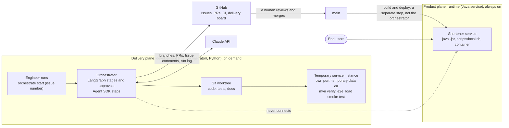
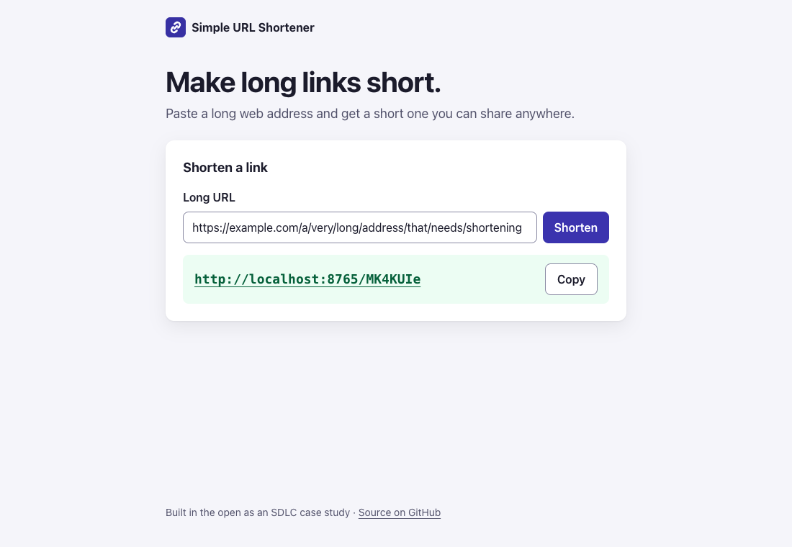
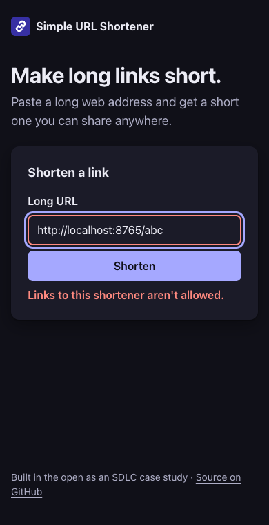

# Simple URL Shortener

A small, backend-focused URL shortener, built in the open as a **complete SDLC case study**. The system is deliberately simple. The point is the *process*: every requirement, decision, change and incident is traceable from idea to production, through three phases:

1. **Greenfield**: from idea to a tested v1.
2. **Brownfield**: evolving the running system feature by feature.
3. **Reliability**: making it production-grade, with measurements.

> **Status:** **Release 1 (greenfield) complete**, tagged [`v1.0.0`](docs/releases/v1.0.0.md). [Spec 0001](docs/specs/0001-v1-core.md) is implemented: the JSON API (create, Redirect, URL Rules, Collision handling) and the web page (works with or without JavaScript; Lighthouse 100 in every category). **Release 2 is in progress:** the delivery orchestrator (R18, [spec 0002](docs/specs/0002-delivery-orchestrator.md)) and the Clickstream (R10, [spec 0003](docs/specs/0003-clickstream.md), [ADR 0021](docs/adr/0021-sqlite-wal-busy-timeout-and-small-connection-pool.md)) are done; analytics and operability follow on the [roadmap](docs/roadmap.md). Releases 2 and 3 are designed (ADRs 0007–0021). **Track the work:** [delivery board](https://github.com/users/SanjuktaDavuluri/projects/1) · [milestones](https://github.com/SanjuktaDavuluri/simple-url-shortener/milestones).

## Reviewer's guide: start here

This README is the map. Every question a reviewer or a new engineer usually asks links to the document that answers it.

| If you want to… | Read |
|---|---|
| See the system in one picture | [Two planes: the product and how it is delivered](#two-planes-the-product-and-how-it-is-delivered) (below) |
| Know what the product does today | [The product](#the-product) · [Spec 0001: v1 core](docs/specs/0001-v1-core.md) · [Spec 0003: Clickstream](docs/specs/0003-clickstream.md) |
| Learn the vocabulary (Link, Short Code, Rule, Redirect, Click, Click Recorder, Referrer Host, Agent Category, Device Class) | [`CONTEXT.md`](CONTEXT.md) |
| Follow a request through the code | [`docs/architecture.md`](docs/architecture.md): sequence diagrams for create and Redirect, the Click flow, and SQLite's WAL and pool settings ([ADR 0021](docs/adr/0021-sqlite-wal-busy-timeout-and-small-connection-pool.md)) |
| Understand *why* it is built this way | [Decisions (ADRs)](#decisions) below · [`docs/adr/`](docs/adr/) |
| Understand the delivery orchestrator | [The delivery orchestrator](#the-delivery-orchestrator) below · [`orchestrator/README.md`](orchestrator/README.md) · ADRs [0007](docs/adr/0007-delivery-orchestrator.md)–[0011](docs/adr/0011-orchestrator-replanning-and-lineage.md) |
| See what each Release delivered | [Release notes](docs/releases/) · [`CHANGELOG.md`](CHANGELOG.md) |
| See what's planned, deferred, and why | [`docs/roadmap.md`](docs/roadmap.md): releases, ordering and a re-prioritisation log |
| Trace a feature from requirement to code | [Specs](docs/specs/) → [Issues](https://github.com/SanjuktaDavuluri/simple-url-shortener/issues?q=is%3Aissue) → [pull requests](https://github.com/SanjuktaDavuluri/simple-url-shortener/pulls?q=is%3Apr) → commits. Each PR says `Closes #n` |
| See how it is tested | [Integration-testing plan](docs/plans/0001-integration-testing.md) (traceability matrix, [spec 0003 coverage](docs/plans/0001-integration-testing.md#spec-0003-coverage)) · `src/test/` · [browser checks](e2e/README.md) · [CI workflow](.github/workflows/ci.yml) |
| Run it or contribute | [Quick start](#quick-start) below · [onboarding guide](docs/onboarding.md) |
| See the working rules the team (and Claude Code) follow | [`CLAUDE.md`](CLAUDE.md): project charter |

## Two planes: the product and how it is delivered

The repository holds two separate things, with **separate entry points**:

- **The product plane** is the URL shortener: a Java service, always on, used by end users. It's started with `java -jar`, `scripts/local.sh` or a container.
- **The delivery plane** is the **delivery orchestrator**: a development-time tool in `orchestrator/` (Python, planned for Release 2), run on demand by an engineer with `orchestrate`.

The orchestrator turns a request into specs, tickets, code and pull requests. **It never deploys, and it never connects to a running service.** Its test stages start their own temporary copy of the service. The only way a change reaches the product is a pull request that **a human reviews and merges** ([ADR 0007](docs/adr/0007-delivery-orchestrator.md)).



## The product

<p>
  
  
</p>

### Available now (v1, [spec 0001](docs/specs/0001-v1-core.md))

- **Shorten:** submit a Long URL and get back a Short URL such as `http://localhost:8000/Ab3xK9q`, through the JSON API (`POST /links`) or the web page.
- **Redirect:** opening a Short URL sends you to its Long URL with a `302 Found`.
- **URL Rules:** only `http`/`https` addresses with a host, at most 2048 characters, and never a link back to the shortener itself. Each refusal comes with a clear Rejection Reason (`422`).
- **Web page:** a single server-rendered page with no full page reloads, copy-to-clipboard, and light and dark mode. It works with JavaScript off.

### Done in Release 2, to be tagged at its close-out (roadmap R10, [spec 0003](docs/specs/0003-clickstream.md))

- **Clicks recorded:** every successful `GET` Redirect records one Click (Short Code, time, Referrer Host, Agent Category, Device Class) in a `clicks` table. Clicks are queued and saved in batches by a background writer, so the Redirect never waits for the database. The `302` is sent before the Click is handed over, and a failure while handing it over costs only that Click (logged as a warning), never the Redirect; a Redirect also completes while a Click batch holds SQLite's write lock. Loss is bounded and counted, never an error ([ADR 0012](docs/adr/0012-clicks-recorded-asynchronously.md)): a full queue drops new Clicks, and a batch that fails to save is dropped whole, with no retry. Drops are logged as a single warning carrying only the count, at most once per flush interval (any held back are logged when the writer stops), and the writer logs its start and stop. On a normal shutdown the writer stops after the web server, so Redirects served while shutting down are still recorded, and it saves the queued Clicks within `CLICK_SHUTDOWN_TIMEOUT`; any it cannot save in time are dropped and counted. The full `Referer` and the raw `User-Agent` are never stored ([ADR 0013](docs/adr/0013-clicks-store-minimal-non-personal-data.md)). A `404`, a `HEAD` request and Link creation record nothing. There is no way to read Clicks over HTTP yet: the stats API comes with R2.

How it works: the [Redirect and Click flows](docs/architecture.md#the-click-flow-clickstream) and [SQLite concurrency](docs/architecture.md#sqlite-concurrency-adr-0021) in the architecture, the [glossary](CONTEXT.md) terms *Click Recorder*, *Referrer Host*, *Agent Category* and *Device Class*, the settings and code tour in [onboarding](docs/onboarding.md), the test evidence in [plan 0001](docs/plans/0001-integration-testing.md#spec-0003-coverage), and the [roadmap](docs/roadmap.md) (R10: done, with its PRs).

### Planned ([roadmap](docs/roadmap.md))

| Release | Feature | Decided in |
|---|---|---|
| 2 | Click analytics: per-Link stats visible only to the Link's creator, read from the Clicks recorded since R10 | ADRs [0012](docs/adr/0012-clicks-recorded-asynchronously.md), [0013](docs/adr/0013-clicks-store-minimal-non-personal-data.md), [0014](docs/adr/0014-creator-only-stats-via-manage-token.md) |
| 2 | Operability: health checks, metrics, structured logs; container image; OpenAPI contract | [ADR 0015](docs/adr/0015-observability-actuator-micrometer-structured-logs.md) · roadmap R11, R21 |
| 3 | Hardening: rate limits, strict security headers, blocking private and internal addresses | ADRs [0016](docs/adr/0016-in-app-rate-limiting-per-client-ip.md), [0017](docs/adr/0017-strict-content-security-policy-and-security-headers.md), [0018](docs/adr/0018-private-address-rule-without-dns.md) |
| 3 | Reliability evidence: load-test baseline against SLOs, failure-mode testing, scaling path | [ADR 0019](docs/adr/0019-staged-evidence-triggered-scaling-path.md) · roadmap R13, R14 |
| 3 | Expiring links, delivered as a requirement-clarification case study | roadmap R3, R23 |

## The delivery orchestrator

*Built in Release 2 (roadmap R18, tickets #26–#35; spec 0002 implemented), with the Claude Agent SDK as its agent. Available now: a full Run with parallel Lanes and Re-plan, under policy guardrails, with retries, pause and resume, Rollback, Safe-stop and cost caps: intake, requirements, design, decompose, Lanes (implement → document → PR → human merge), release readiness and close-out, via `start`, `status`, `resume`, `replan`, `approve`, `reject`, `verify` and `metrics`. See [`orchestrator/README.md`](orchestrator/README.md).*

An engineer starts a run from a GitHub Issue: `orchestrate start <issue>`. The orchestrator then drives the request through fixed stages: **intake → requirements → design → decompose → per-ticket lanes (implement → document → PR) → release readiness → close-out**. Each stage has an exit gate. A human approves the spec, any ADRs, the tickets and every merge. Each run leaves a tamper-evident event log and a report in the repository, and delivery metrics are derived from them.

| Topic | ADR |
|---|---|
| What it is, where it lives, how it is used, what it's built with (Python, Claude Agent SDK, LangGraph) | [0007](docs/adr/0007-delivery-orchestrator.md) |
| Stages, gates, human approvals, retries, rollback and safe-stop | [0008](docs/adr/0008-orchestrator-stage-graph-and-governance.md) |
| State, the hash-chained audit trail and delivery metrics | [0009](docs/adr/0009-orchestrator-state-audit-and-metrics.md) |
| Policy guardrails, checked before every action and after every step | [0010](docs/adr/0010-orchestrator-policy-guardrails.md) |
| Re-planning when inputs change, without redoing unaffected work | [0011](docs/adr/0011-orchestrator-replanning-and-lineage.md) |
| Parallel Lanes: agent work fans out in the graph, human waits are held at the join | [0020](docs/adr/0020-parallel-lanes-fan-out-in-the-graph-waits-at-the-join.md) |

## Decisions

Every significant decision is an ADR that lists the options weighed and why one won.

| # | Decision | Area |
|---|---|---|
| [0001](docs/adr/0001-java-spring-boot-stack.md) | Java 25 (LTS), Spring Boot 4.1, Maven Wrapper | Stack |
| [0002](docs/adr/0002-sqlite-for-v1-storage.md) | SQLite via `JdbcClient` and Flyway, behind a Link Store interface | Storage |
| [0003](docs/adr/0003-random-short-codes.md) | 7 random base62 characters, independent of the Long URL, retried on Collision | Short Codes |
| [0004](docs/adr/0004-url-rules-as-separate-module.md) | URL Rules in their own `rules` package, each tested on its own | Validation |
| [0005](docs/adr/0005-302-redirects-keep-us-in-the-path.md) | `302` redirects, so every Click passes through the shortener | Redirects |
| [0006](docs/adr/0006-htmx-progressive-enhancement-web-page.md) | Server-rendered Thymeleaf page, progressively enhanced with HTMX | Web page |
| [0007](docs/adr/0007-delivery-orchestrator.md) | Delivery orchestrator: a separate, development-time plane | Delivery |
| [0008](docs/adr/0008-orchestrator-stage-graph-and-governance.md) | Orchestrator stage graph and human approval model | Delivery |
| [0009](docs/adr/0009-orchestrator-state-audit-and-metrics.md) | Local state; hash-chained audit log in the repo; derived metrics | Delivery |
| [0010](docs/adr/0010-orchestrator-policy-guardrails.md) | Policy guardrails enforced before and after every step | Delivery |
| [0011](docs/adr/0011-orchestrator-replanning-and-lineage.md) | Re-planning through content-hash lineage | Delivery |
| [0012](docs/adr/0012-clicks-recorded-asynchronously.md) | Clicks recorded asynchronously, with bounded and measured loss | Analytics |
| [0013](docs/adr/0013-clicks-store-minimal-non-personal-data.md) | Clicks store minimal, non-personal data | Analytics, privacy |
| [0014](docs/adr/0014-creator-only-stats-via-manage-token.md) | Creator-only stats, authorised by a hashed manage token | Analytics, security |
| [0015](docs/adr/0015-observability-actuator-micrometer-structured-logs.md) | Health, metrics and JSON logs on a separate management port | Operability |
| [0016](docs/adr/0016-in-app-rate-limiting-per-client-ip.md) | In-app per-IP rate limits; IPs never stored | Security |
| [0017](docs/adr/0017-strict-content-security-policy-and-security-headers.md) | Strict, enforced Content-Security-Policy and security headers | Security |
| [0018](docs/adr/0018-private-address-rule-without-dns.md) | Private-address Rule, checked as written, with no DNS lookup | Security |
| [0019](docs/adr/0019-staged-evidence-triggered-scaling-path.md) | Staged scaling path, each stage triggered by measurements | Scalability |
| [0020](docs/adr/0020-parallel-lanes-fan-out-in-the-graph-waits-at-the-join.md) | Parallel Lanes: fan-out in the graph, waits held at the join | Delivery |
| [0021](docs/adr/0021-sqlite-wal-busy-timeout-and-small-connection-pool.md) | SQLite in WAL mode with a busy timeout and a pool of 4, so Redirects never wait behind Click writes | Storage |

## Quick start

You only need **JDK 25** (e.g. Temurin); the Maven Wrapper downloads Maven and every dependency. For full setup, the repo tour and how work flows, read the **[onboarding guide](docs/onboarding.md)**.

```bash
git config core.hooksPath .githooks   # optional local guard; main is also protected on GitHub
./mvnw verify                         # format check, compile, static analysis, unit + integration tests
./mvnw spotless:apply                 # fix formatting if verify complains
(cd e2e && npm ci && BASE_URL=http://localhost:8000 npm run all)   # browser checks + Lighthouse; needs the app running and Chrome
./mvnw spring-boot:run                # start the app on http://localhost:8000 (foreground)
scripts/local.sh start                # or: build and run it in the background (stop | restart | status | logs)
```

Try it:

```bash
curl -s -X POST localhost:8000/links -H 'content-type: application/json' \
     -d '{"url": "https://example.com/very/long"}'
# {"short_code":"mFzrymu","short_url":"http://localhost:8000/mFzrymu","long_url":"https://example.com/very/long"}
curl -si localhost:8000/mFzrymu    # 302, Location: https://example.com/very/long, Cache-Control: no-store

curl -s -X POST localhost:8000/links -H 'content-type: application/json' -d '{"url": "ftp://example.com"}'
# 422 {"detail":"Only http:// and https:// web addresses can be shortened.",
#      "instance":"/links","status":422,"title":"Unprocessable Content"}
```

| Setting | Default | Purpose |
|---|---|---|
| `BASE_URL` | `http://localhost:8000` | The shortener's public address; every Short URL starts with it |
| `DATABASE_PATH` | `links.db` | Where the SQLite database file lives (schema created by Flyway on startup). It runs in WAL mode, so `links.db-wal` and `links.db-shm` sit beside it: back up, move or delete the three together, and keep them on a local disk ([onboarding](docs/onboarding.md), ADR 0021) |
| `PORT` | `8000` | HTTP port |
| `CLICK_QUEUE_CAPACITY` | `10000` | Most Clicks waiting to be saved; any more are dropped and counted (ADR 0012) |
| `CLICK_BATCH_SIZE` | `500` | Most Clicks saved in one batch |
| `CLICK_FLUSH_INTERVAL` | `1s` | Longest the background writer waits for a batch to fill before it saves what it has; also the shortest gap between two dropped-Click warnings |
| `CLICK_SHUTDOWN_TIMEOUT` | `10s` | Longest a normal shutdown waits, after the web server stops, for queued Clicks to be saved; any still unsaved are dropped, counted and logged |

## Repository layout

```
src/main/java/…/shortener/   the service: controllers, LinkService, Link Store, Short Code generator
src/main/java/…/rules/       URL Rules and the Rule Set (ADR 0004)
src/main/java/…/clicks/      Clickstream (spec 0003): Click Classifier, Click Recorder (queue + batch writer), Click Store
src/main/resources/          configuration, Flyway migrations, Thymeleaf templates, static assets
src/test/                    unit tests (*Test) and integration tests (*IT)
e2e/                         browser checks (Playwright) and Lighthouse audits
scripts/                     local.sh (run the app in the background), board-status.sh (delivery board)
docs/                        ADRs, specs, plans, roadmap, releases, architecture, onboarding
orchestrator/                the delivery orchestrator (Python, uv; being built in Release 2)
CONTEXT.md · CLAUDE.md       domain glossary · project charter
```

## How this project is run

| Artifact | Where | Purpose |
|---|---|---|
| Domain glossary | [`CONTEXT.md`](CONTEXT.md) | One shared vocabulary for code, tickets and docs |
| Architecture Decision Records | [`docs/adr/`](docs/adr/) | Significant decisions only, each with the options weighed and why one won |
| Roadmap | [`docs/roadmap.md`](docs/roadmap.md) | Every deferred item, prioritised into releases and tracked to completion |
| Architecture | [`docs/architecture.md`](docs/architecture.md) | The two planes, request flows, the Click flow and SQLite concurrency (Mermaid) |
| Onboarding | [`docs/onboarding.md`](docs/onboarding.md) | Setup, repo tour and how work flows, for a new engineer or reviewer |
| Specs | [`docs/specs/`](docs/specs/) | Numbered requirements with a status lifecycle; each traces to a roadmap item |
| Tickets | GitHub Issues, on the [delivery board](https://github.com/users/SanjuktaDavuluri/projects/1) and grouped by [milestone](https://github.com/SanjuktaDavuluri/simple-url-shortener/milestones) per release | Vertical-slice tickets; every change traces to one |
| Tests & CI | `src/test/`, GitHub Actions | Built test-first (TDD); unit + integration tests; CI gates every PR |
| Plans | [`docs/plans/`](docs/plans/) | How cross-cutting work is verified and delivered, e.g. the [integration-testing plan](docs/plans/0001-integration-testing.md) |
| Changelog and release notes | [`CHANGELOG.md`](CHANGELOG.md), [`docs/releases/`](docs/releases/) | One tagged version per Release, with notes: what shipped, evidence, what was deferred, lessons learned |
| Runbook, incidents | *(introduced in later Releases)* | Operational evidence |

Artifacts are introduced **when their phase arrives**, so the history shows them being adopted rather than scaffolded up front. Work is driven with [Matt Pocock's engineering skills](https://github.com/mattpocock/skills) for Claude Code: grilling, domain modeling, spec, tickets, TDD and code review.

## Roadmap

| Release | Theme |
|---|---|
| 1 ✅ `v1.0.0` | Greenfield v1: build, all tests green, CI ([release notes](docs/releases/v1.0.0.md)) |
| 2 | Delivery orchestrator, click analytics, operability (health, metrics, logs, container, OpenAPI) |
| 3 | Hardening and reliability evidence: security gaps closed, risk register, load and failure testing, expiring links case study, scaling path, write-ups |
| later | PostgreSQL, horizontal scaling, custom aliases, edit/delete, and more, each with its reason for waiting |

Details, ordering rationale, status and the re-prioritisation log are in [`docs/roadmap.md`](docs/roadmap.md).
