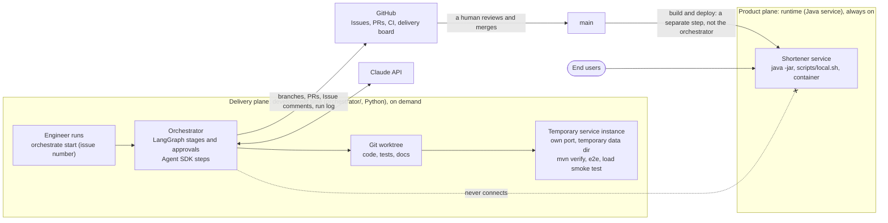

# A delivery orchestrator: a separate plane, in its own module, built with Python, the Claude Agent SDK and LangGraph

Until now, delivery has been *practised*: an engineer and Claude Code follow the workflow skills, the rules in `CLAUDE.md`, CI and branch protection. That works, but it can't be run, inspected or measured as a system. We are adding a **delivery orchestrator**: a program that takes an engineering request and drives it through requirements, design, decomposition, implementation, testing, documentation and release readiness. It enforces gates and human approvals, keeps state and an audit trail, and reports delivery metrics. This ADR fixes *what it is, where it lives, how it is used and what it is built with*. ADR 0008 fixes the stage graph and governance model.

## Decisions

1. **A separate delivery plane.** The orchestrator is engineering tooling. It changes the shortener only through reviewed pull requests and is **never** on the shortener's request path. End users never interact with it.
2. **Same repository, its own module.** It lives in `orchestrator/`, with its own build and tests, and is **never** packaged into the service's jar or container image. Keeping it next to the product means every run's audit trail links directly to this repository's Issues, PRs and commits.
3. **On demand, bounded runs.** Each run starts from one request or Issue and ends in pull requests for a human to review. It is not an always-on agent that changes the service by itself.
4. **A command-line tool, with GitHub as the record.** The engineer runs `orchestrate start | status | approve | reject | resume | stop | replan | metrics`. Every run is tied to a GitHub Issue: questions, answers, decisions and approvals are mirrored there as comments, and approvals can also be given on GitHub (labels, PR reviews).
5. **Stack: Python + Claude Agent SDK + LangGraph.**
   - **LangGraph** provides the explicit state graph: parallel fan-out and join, persisted checkpoints, pausing for human approval and resuming, per-step retry policies, and resuming from a checkpoint.
   - **The Claude Agent SDK** (Claude Code as a library) runs the agent steps with built-in file, edit and shell tools, tool allow-lists, permission modes, **hooks** that enforce guardrails inside a step, sessions, structured output and per-call cost reporting.
   - We build the project-specific layer: gates, policy guardrails, rollback and safe-stop, the audit log, metrics and re-planning.
   - Agent calls sit behind one interface, so tests use a scripted fake agent and run deterministically at no cost.
   - Model: `claude-opus-5-5`.

6. **Development time only; it never touches a running deployment.** The orchestrator is a development workflow tool with its own entry point (`orchestrate`), separate from the service's entry points (`java -jar`, `scripts/local.sh`, the container). A run ends at a pull request that is ready to merge and **never deploys**. Merging is a human decision, and deployment is a separate step. Validation stages start their **own temporary instances** of the service on another port with a temporary data directory. The orchestrator never connects to, restarts or changes a running deployment, including the maintainer's local service on port 8000.

### The two planes

## Options considered and the trade-offs

### Role and placement

| | Option | What we'd gain | What it would cost | Verdict |
|---|---|---|---|---|
| A | **Separate delivery plane, same repo, `orchestrator/` module, on demand** | Product and delivery system side by side, with direct traceability; a clear boundary | Needs a clearly documented boundary so it isn't mistaken for part of the service | **Chosen** |
| B | Separate repository | The cleanest separation; reusable on other projects | Two repositories to follow; traceability crosses repo boundaries; two CI setups and release processes | Rejected |
| C | A Claude Code plugin (skills only) | Familiar | Instructions only: no enforced gates, persisted state or metrics | Rejected: not a runnable system |
| D | Embedded in the service, or always-on self-improving | — | Mixes a production runtime with code-changing agents; unrequested changes; a serious security and change-control risk | Rejected |

### Control surface

| | Option | What we'd gain | What it would cost | Verdict |
|---|---|---|---|---|
| A | **CLI, with GitHub as the record** | Fast interaction; reuses the engineer's logged-in tooling; an asynchronous, reviewable record on GitHub | Runs execute on an engineer's machine | **Chosen** |
| B | GitHub Actions only (`/orchestrate` comments) | Fully asynchronous and visible | An API key as a repo secret, cost per run, minutes per exchange | Rejected |
| C | Web dashboard | Visual | A whole extra UI to build and test | Rejected for now; a read-only HTML run report may follow |

### Stack

| | Option | What we'd gain | What it would cost | Verdict |
|---|---|---|---|---|
| A | **Python + Claude Agent SDK + LangGraph** | Graph, checkpoints, approval pauses, retries and resume come ready-made; Agent SDK hooks enforce guardrails inside agent steps; effort goes into governance | Two dependencies to pin; LangGraph's API changes quickly | **Chosen** |
| B | TypeScript + Agent SDK + our own graph engine | Typed; we fully own the engine | More plumbing to build and prove (durability, joins, resume) in the time available | Rejected |
| C | Agent SDK + Temporal | Industrial-grade durability and a run UI | Needs a Temporal server; steep learning curve; heavy for one repository | Rejected |
| D | Java + Claude Code run headlessly (`claude -p`) | Same language as the service | Agent steps sit behind a command-line boundary with no in-process hooks; the graph engine is entirely ours | Rejected |

**In short:** we chose a separate on-demand plane in its own module, so delivery is inspectable but can't touch the runtime. We chose a CLI with GitHub as the record because it is fast for the engineer and reviewable by anyone. We chose Python + Agent SDK + LangGraph because it buys the hard workflow mechanics and leaves our effort for governance.

## Consequences

- The repository has two languages with separate toolchains: Java/Maven for the service, Python/uv for `orchestrator/`. CI gets separate jobs, and the README opens with a two-plane diagram.
- LangGraph and the Agent SDK versions are pinned. Upgrades are deliberate changes.
- Running the orchestrator needs Claude credentials on the engineer's machine. Nothing secret is stored in the repository.
- The service needs nothing to support the orchestrator: no admin endpoints, no listeners, no shared state. Its temporary test instances are built from the branch under change. The two-planes diagram above is repeated at the top of the README, `docs/architecture.md` and `CLAUDE.md`, so a reviewer sees the boundary first.
