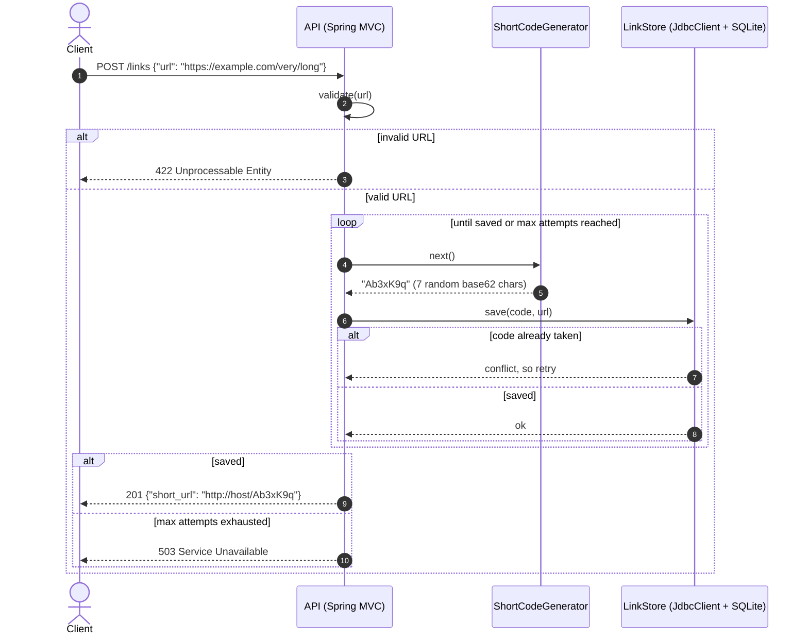
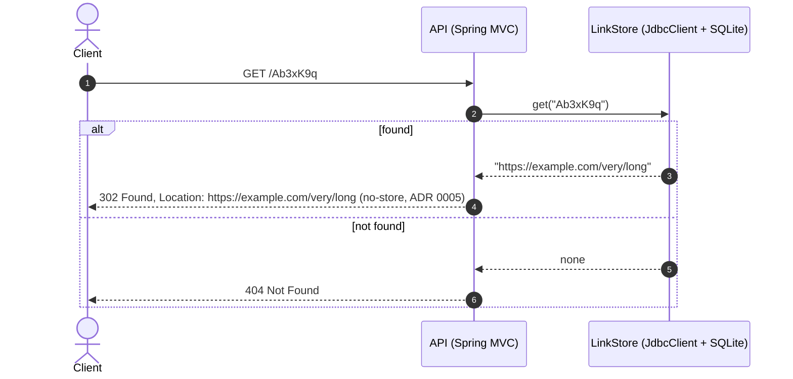

# Architecture

## Request flows (v1)

### Create a short link

The code generator takes **no input**; it never sees the long URL (ADR 0003). The database's uniqueness constraint is the final guarantee against duplicate codes. Shortening the same URL twice creates two independent links.

### Follow a short link

