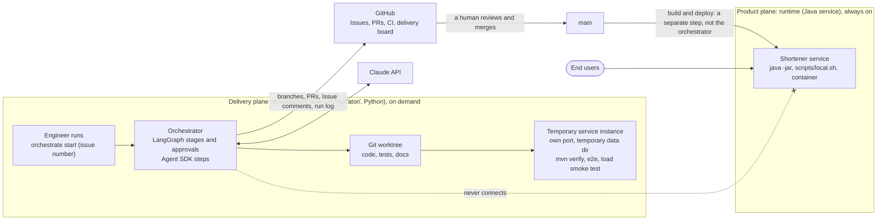
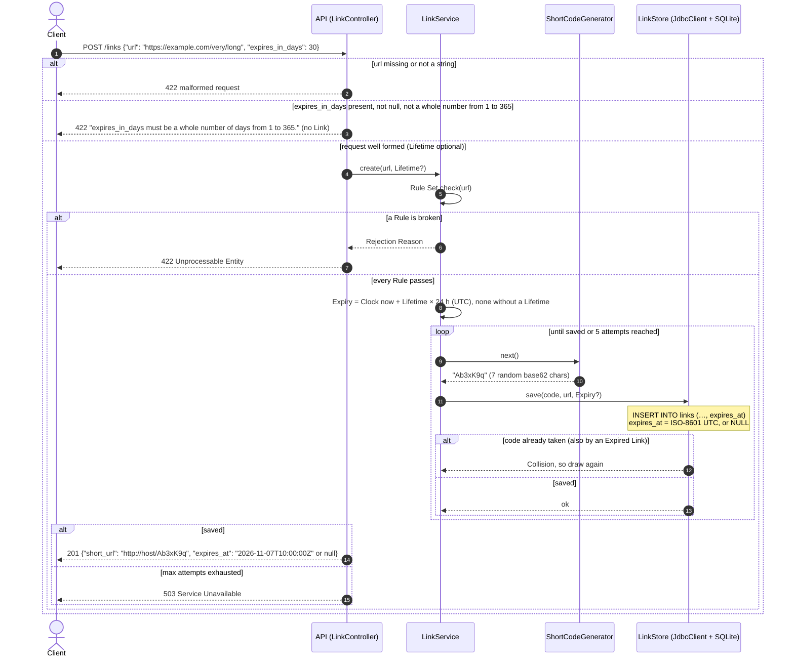
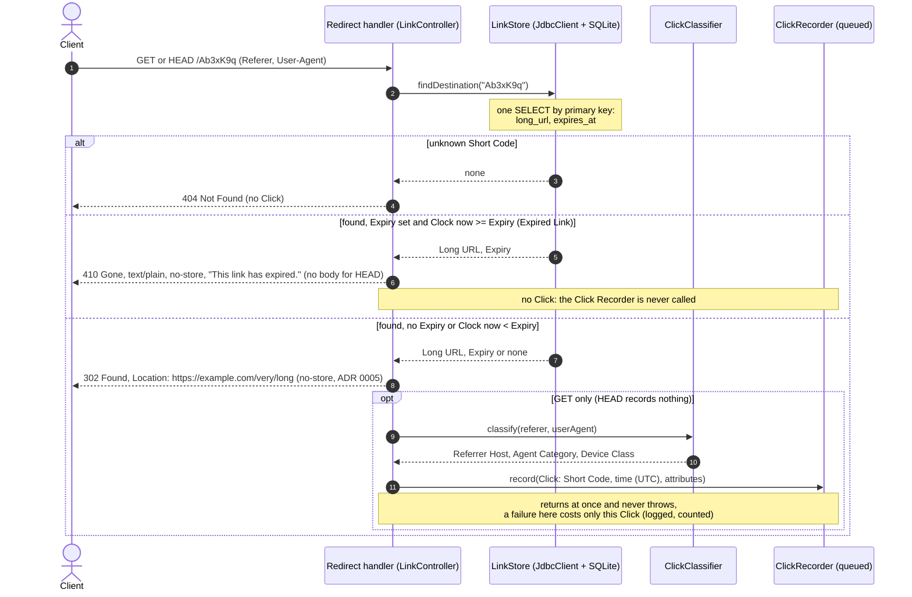
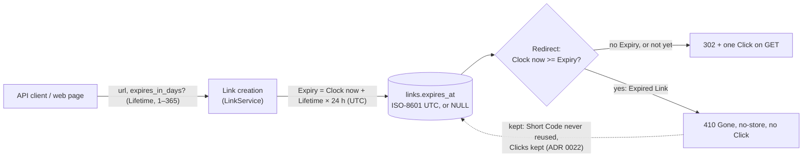
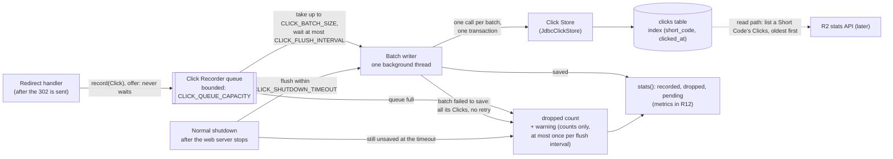
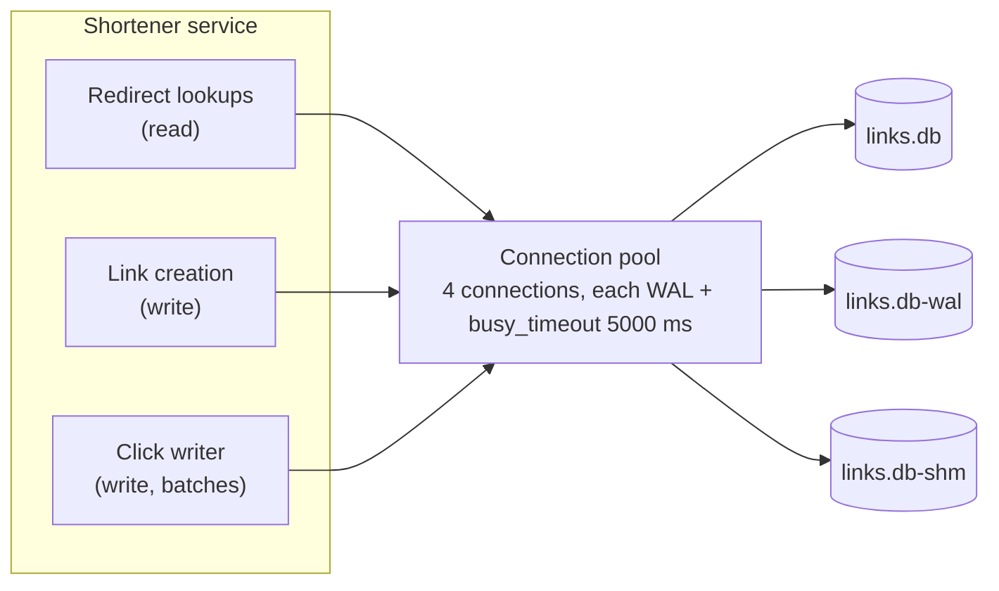
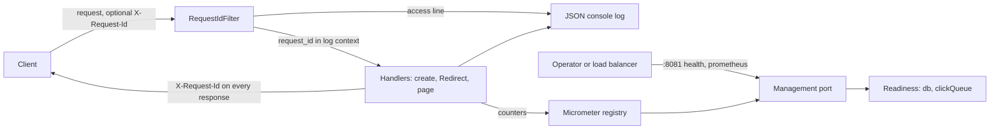
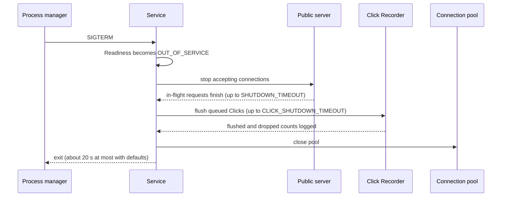

# Architecture

## The two planes

The repository holds two separate systems with **separate entry points**. The **product plane** is the Java service that end users use. The **delivery plane** is the development-time orchestrator (`orchestrator/`, planned for Release 2) that turns requests into reviewed pull requests. The orchestrator never deploys and never connects to a running service. Its validation stages start temporary instances on their own port and data directory. A change reaches the product only when a human merges a PR ([ADR 0007](adr/0007-delivery-orchestrator.md)).

The rest of this document describes the product plane. The orchestrator's stage graph is in [ADR 0008](adr/0008-orchestrator-stage-graph-and-governance.md).

## Request flows

### Create a short link

The code generator takes **no input**; it never sees the long URL (ADR 0003). The database's uniqueness constraint is the final guarantee against duplicate codes. Shortening the same URL twice creates two independent links.

Since [spec 0004](specs/0004-expiring-links.md) the request may carry an optional **Lifetime** (`expires_in_days`, a whole number of days from 1 to 365). The request is checked in order: its shape (a malformed request), then the Lifetime (a validation message, not a Rejection Reason, because Lifetime is not a Rule), then the Rule Set. `LinkService` turns the Lifetime into a fixed **Expiry**: the creation instant from the injected `Clock` plus the Lifetime in exact 24-hour days, in UTC. The Link Store saves it in the nullable `links.expires_at` column (Flyway `V3__add_link_expiry.sql`); a Link created without a Lifetime stores `NULL` and never expires. The `201` always carries `expires_at`. The web page (`POST /`) uses the same `LinkService` path, so the two entry points can't drift. The Manage Token that the `201` also carries since #104 ([spec 0005](specs/0005-click-stats-per-link.md)) is left out of this diagram.

### Follow a short link (the Redirect)

The Redirect handler (`LinkController.followLink`) is the single point where Clicks are produced (ADR 0005). Since Release 2 ([spec 0003](specs/0003-clickstream.md)) a successful `GET` Redirect sends its `302` first, then builds a **Click** and hands it to the **Click Recorder**, which returns at once and never throws ([ADR 0012](adr/0012-clicks-recorded-asynchronously.md)). The `Click Classifier` reduces the raw `Referer` and `User-Agent` to a Referrer Host, an Agent Category and a Device Class in memory; the raw values are never stored or logged, and the IP address is not read at all ([ADR 0013](adr/0013-clicks-store-minimal-non-personal-data.md)). A `404` and a `HEAD` request record nothing. For a Link that hasn't expired, the response is byte-for-byte what Release 1 sent.

Since [spec 0004](specs/0004-expiring-links.md) the lookup returns the Long URL **and the Expiry** in one query by primary key (`findDestination`), so the Redirect is still one database lookup. The handler compares the Expiry with the injected `Clock` in Java, not in SQL. From the exact instant of its Expiry (`now >= Expiry`) a Link is an **Expired Link**: its Short URL answers `410 Gone` with `Content-Type: text/plain;charset=UTF-8`, `Cache-Control: no-store` and the body `This link has expired.` (`HEAD` gets the same status and headers with no body), and the Click Recorder is never called. A Link with no Expiry never expires. So the Redirect has three branches:

### A Link's Expiry (Expiring Links)

The Expiry is fixed when the Link is created and never changes, so Links stay immutable and nothing has to run in the background: there is no purge job, no new setting, and expiry depends only on time, never on Clicks. An Expired Link **stays stored** in `links`, so the primary key keeps refusing its Short Code: drawing it again is a Collision like any other, and an old Short URL can never start sending people somewhere new. Its Clicks stay in `clicks` for auditing and R2 ([ADR 0022](adr/0022-expired-links-kept-short-codes-never-reused.md)). Links created before `V3__add_link_expiry.sql` have `expires_at` `NULL` and never expire.

### The Click flow (Clickstream)

The `QueuedClickRecorder` keeps Clicks in a **bounded in-memory queue** (`CLICK_QUEUE_CAPACITY`) and offers each one without waiting. **One background writer** takes up to `CLICK_BATCH_SIZE` Clicks at a time, waiting at most `CLICK_FLUSH_INTERVAL` for a batch to fill, and saves each batch with one **Click Store** call in one transaction. `JdbcClickStore` is the only code that touches the `clicks` table (Flyway `V2__create_clicks.sql`, indexed by Short Code and time), as the Link Store is for `links` (ADR 0002). Loss is bounded and counted, never an error: a Click that meets a full queue, and every Click in a batch that fails to save, are **dropped and counted**, with no retry. Drops are logged as one warning carrying counts only, at most once per flush interval. The recorder keeps `stats()` (recorded, dropped, pending) for R12 to publish as metrics (ADR 0015).

On a normal shutdown the recorder, a Spring `SmartLifecycle` bean, stops **after** the web server has stopped taking requests, so Redirects served while shutting down are still recorded. It **flushes** the queue for up to `CLICK_SHUTDOWN_TIMEOUT`; Clicks still unsaved then are dropped, counted and logged. A crash, unlike a normal shutdown, loses the Clicks still queued.

### SQLite concurrency (ADR 0021)

Two writers now share SQLite's single write lock: Link creation and the Click writer. [ADR 0021](adr/0021-sqlite-wal-busy-timeout-and-small-connection-pool.md) sets, on every pooled connection through the SQLite JDBC driver's connection properties in `application.properties`:

| Setting | Value | Effect |
|---|---|---|
| `journal_mode` | `WAL` | Readers never wait for the writer, so a Redirect lookup completes while a Click batch is being written |
| `busy_timeout` | `5000` ms | The two writers queue for the write lock instead of failing |
| Hikari `maximum-pool-size` | `4` (was 1) | A Redirect lookup gets its own connection while the Click writer holds one |

The database is therefore **three files**: `links.db`, `links.db-wal` and `links.db-shm`. Back up, move or delete them together, and keep them on a local file system (never NFS or SMB); see [onboarding](onboarding.md#3-run-it).

### Operability (spec 0006, ADR 0015)

Every public request passes `RequestIdFilter` first: it takes or generates the Request ID, puts it in the logging context and the `X-Request-Id` response header, and writes one access line. Health and metrics are served on a separate management port (`MANAGEMENT_PORT`, default 8081), never on the public port. See the [runbook](runbook.md).

### Shutdown sequence

