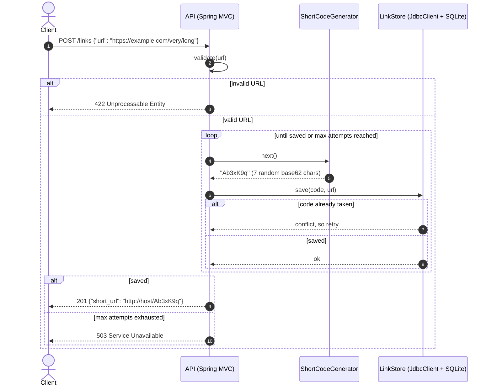
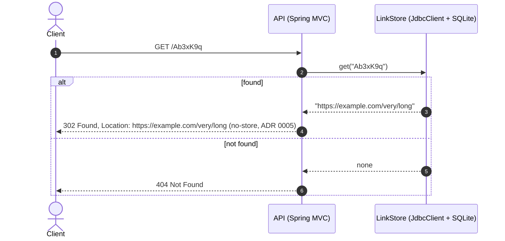

# Architecture

## The two planes

The repository holds two separate systems with **separate entry points**. The **product plane** is the Java service that end users use. The **delivery plane** is the development-time orchestrator (`orchestrator/`, planned for Release 2) that turns requests into reviewed pull requests. The orchestrator never deploys and never connects to a running service. Its validation stages start temporary instances on their own port and data directory. A change reaches the product only when a human merges a PR ([ADR 0007](adr/0007-delivery-orchestrator.md)).

The rest of this document describes the product plane. The orchestrator's stage graph is in [ADR 0008](adr/0008-orchestrator-stage-graph-and-governance.md).

## Request flows (v1)

### Create a short link

The code generator takes **no input**; it never sees the long URL (ADR 0003). The database's uniqueness constraint is the final guarantee against duplicate codes. Shortening the same URL twice creates two independent links.

### Follow a short link

