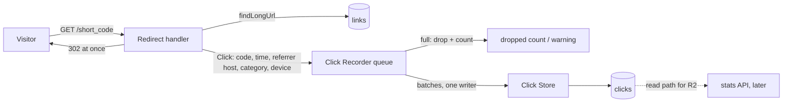

# Spec 0003: Clickstream: record a Click for every successful Redirect

Glossary: `CONTEXT.md` · Decisions: ADR 0002, ADR 0005, ADR 0012, ADR 0013 (and ADR 0015 for the later metrics) · Flows: `docs/architecture.md` · Roadmap: **R10** in `docs/roadmap.md` · Issue: [#49](https://github.com/SanjuktaDavuluri/simple-url-shortener/issues/49)

## Problem Statement

Every Redirect passes through the shortener (ADR 0005), but nothing is remembered once the `302` has been sent. The operator can't audit how a Link has been used, and the analytics the product promises (R2: Click counts and a per-Link stats view, ADR 0014) have no data to be built on. Release 1 only guaranteed that every Click passes through one Redirect point (spec 0001, Out of Scope).

Recording Clicks touches the product's hot path. The Redirect is what people who receive a Short URL experience, and SQLite allows one writer at a time (ADR 0002). If recording were slow or failed, people following Links would pay for it. Recording also reads request headers that could identify a person if they were kept as sent.

## Solution

Every successful Redirect produces exactly one **Click**: the Short Code, the time in UTC, the referrer's **host only**, and the user agent reduced to a **category** (`browser`, `bot` or `other`) and a **device class** (`desktop` or `mobile`). No IP address, raw user agent or full referrer URL is ever stored or logged (ADR 0013).

The Redirect hands the Click to a **Click Recorder** and returns its `302` at once. The Click Recorder keeps Clicks in a **bounded in-memory queue**. A single background writer saves them to a new `clicks` table in **batches**. When the queue is full, the Click is **dropped and counted**, never waited for. On a normal shutdown, queued Clicks are **flushed** before the app exits (ADR 0012). The counts of recorded, dropped and pending Clicks are kept by the Click Recorder, so loss is measured from day one; R12 publishes them as metrics (ADR 0015).

Nothing visible to API clients or visitors changes. The Redirect, the JSON API and the web page behave and respond exactly as before. Stored Clicks are the foundation that R2's stats API reads from.

## User Stories

### Following Links (unchanged for the visitor)

1. As a person following a Short URL, I want the Redirect to respond exactly as before (`302`, `Location`, `Cache-Control: no-store`), so that recording Clicks changes nothing I can see.
2. As a person following a Short URL, I want my Redirect never to wait for a Click to be saved, so that the Link is as fast as it was before analytics existed.
3. As a person following a Short URL, I want my Redirect to succeed even if Clicks can't be recorded (queue full, database write failing), so that analytics can never break the core product.
4. As a person following a Short URL, I want the shortener not to keep my IP address, my exact browser string or the page I came from, so that following a Link doesn't leave a personal trail.

### Recording Clicks

5. As the operator, I want exactly one Click recorded for every successful Redirect, so that counts and audits match real use.
6. As the operator, I want no Click recorded for an unknown Short Code (`404`), a path that can't be a Short Code, a `HEAD` request, Link creation or the web page, so that only real Redirects are counted.
7. As the operator, I want each Click to carry its Short Code and the UTC time the Redirect was served, so that Clicks can be counted per Link and over time.
8. As the operator, I want the referrer kept as its host only (lower-case, without port, user info, path or query), and absent when there is no `Referer` or it isn't a valid `http`/`https` URL, so that I learn which sites send traffic without storing private URLs.
9. As the operator, I want each Click's user agent reduced to `browser`, `bot` or `other`, so that analytics can tell people from machines without keeping the raw string.
10. As the operator, I want known crawlers and link-preview fetchers (search engines, chat and social previews) classified as `bot`, and kept rather than discarded, so that R2 can leave them out of the headline count and the decision can be revisited later.
11. As the operator, I want requests with no user agent, or from scripts and tools such as `curl`, classified as `other`, so that they are neither counted as people nor mistaken for known bots.
12. As the operator, I want each Click's device class recorded as `mobile` or `desktop`, so that R2 can show the desktop/mobile split.

### Reliability and loss

13. As the operator, I want Clicks written in batches by one background writer, so that recording adds as little write contention as possible to SQLite.
14. As the operator, I want the queue to have a fixed capacity, so that a traffic spike can't exhaust memory.
15. As the operator, I want a Click that arrives while the queue is full to be dropped and counted, so that overload costs analytics data, never Redirects, and the loss is known.
16. As the operator, I want a batch that fails to save to be counted as dropped and logged, without retry loops or crashing the writer, so that a database problem degrades analytics only and the writer keeps going.
17. As the operator, I want drops logged as a warning that carries counts only (never a referrer, user agent or Long URL), at most once per flush interval, so that loss is visible without flooding the log.
18. As the operator, I want queued Clicks saved before the app exits on a normal shutdown, within a bounded time, so that restarts and deploys don't lose Clicks.
19. As the operator, I want the Click Recorder to keep running counts of recorded, dropped and pending Clicks, so that R12 can publish them as metrics and readiness can report a saturated queue (ADR 0015).
20. As the operator, I want the queue capacity, batch size, flush interval and shutdown timeout set by configuration with conservative defaults, so that I can tune them without a code change (ADR 0012).
21. As the operator, I want a Click to be stored within about one flush interval of its Redirect under normal load, so that analytics lag behind reality by a short, known delay.
22. As the operator, I want Redirect lookups not to wait behind a Click batch being written, so that the Redirect path stays fast while the writer works.

### Auditing and the analytics to come

23. As the operator, I want Clicks kept in their own table, indexed by Short Code and time, so that I can audit a Link's use and R2 can count Clicks per Link and per day efficiently.
24. As the developer of R2, I want to read a Link's stored Clicks through a Click Store interface, never through SQL elsewhere, so that the stats API is built on the same boundary as the Link Store (ADR 0002).
25. As a maintainer, I want Click recording behind a `ClickRecorder` interface, so that a later move to an event bus (ADR 0019 stage 4) replaces one implementation, not the Redirect.
26. As a maintainer, I want the Redirect handler to remain the single point where Clicks are produced, so that no future route can Redirect without recording one (ADR 0005).

### Evidence

27. As an external reviewer, I want a written impact analysis of the modules, APIs and data flows this change touches, so that I can see the brownfield change was understood before it was built.
28. As an external reviewer, I want each acceptance criterion traced to a test in the integration-testing plan's matrix, so that I can check every claim in this spec myself.

## Implementation Decisions

- **Click (the value):** a record of `shortCode`, `clickedAt` (an `Instant`, UTC), `referrerHost` (optional), `agentCategory` (`BROWSER`, `BOT`, `OTHER`) and `deviceClass` (`DESKTOP`, `MOBILE`). Built on the request thread; the time comes from an injected `java.time.Clock` (system UTC in production), so tests can fix it.
- **Click Classifier:** a small, pure unit that turns the raw `Referer` and `User-Agent` header values into `referrerHost`, `agentCategory` and `deviceClass`. The raw values exist only in memory for this call and are never stored or logged (ADR 0013).
  - **Referrer host:** parse the `Referer` as a URI. If it is a valid `http`/`https` URL with a host, keep the host in lower case, without port or user info. Anything else (missing, malformed, other schemes such as `android-app:`) gives no referrer host.
  - **Agent category:** checked in this order. (1) `bot` if the user agent matches the maintained list of crawler and link-preview patterns (case-insensitive substrings such as `bot`, `crawler`, `spider`, `slurp`, `facebookexternalhit`, `embedly`, `whatsapp`, `skypeuripreview`, `bingpreview`), kept in one place with its own unit tests. (2) `browser` if it starts with `Mozilla/`. (3) Otherwise, including no user agent and tools such as `curl`, `wget` or `python-requests`, `other`.
  - **Device class:** `mobile` if the user agent contains a mobile marker (`Mobi`, `Android`, `iPhone`, `iPad`); otherwise `desktop`, including bots and missing user agents.
- **Redirect handler (`LinkController.followLink`):** after the Link Store returns a Long URL for a `GET` request, it builds a Click and hands it to the `ClickRecorder`, then returns the same `302` as before. `404`s and `HEAD` requests record nothing. Handing over a Click never throws into the Redirect: the recorder catches every failure and counts it as dropped.
- **`ClickRecorder` (interface):** `record(Click)`. It must return immediately and never throw (ADR 0012).
- **Queued Click Recorder (the v1 implementation):**
  - A bounded queue (`offer`, never `put`). A full queue drops the Click and increments the dropped count.
  - One background writer thread takes up to *batch size* Clicks at a time, waiting at most *flush interval* for a batch to fill, and saves each batch with one Click Store call in one transaction.
  - A batch that fails to save is counted as dropped (all its Clicks), logged as a warning with the count only, and the writer carries on. There is no retry in this spec; failure behaviour is explored further by R14.
  - Drop warnings are rate-limited to at most one line per flush interval, carrying the number dropped since the last line.
  - It exposes `stats()` (recorded, dropped, pending) and `flush()` (save everything queued so far, then return), used by tests and by shutdown.
  - It runs as a Spring `SmartLifecycle` bean that stops **after** the web server stops taking requests. On stop it flushes until the queue is empty or the shutdown timeout passes; Clicks still queued then are counted as dropped and logged.
- **Click Store:** the only module that touches the `clicks` table, like the Link Store for Links (ADR 0002). Interface: *save a batch of Clicks* and *list the Clicks for a Short Code, oldest first*. The second operation is the read path R2 builds on, and the seam the integration tests observe Clicks through. v1 implementation: `JdbcClient` with plain SQL, batch insert.
- **Schema (Flyway `V2__create_clicks.sql`):** a `clicks` table with `id` (integer primary key), `short_code` (text, not null), `clicked_at` (text, not null, ISO-8601 UTC in the same format as `links.created_at`), `referrer_host` (text, nullable), `agent_category` (text, not null, checked to be `browser`, `bot` or `other`), `device_class` (text, not null, checked to be `desktop` or `mobile`), and an index on `(short_code, clicked_at)`. No foreign key to `links`: SQLite doesn't enforce them by default, and what happens to Clicks when a Link is deleted belongs to R4.
- **SQLite concurrency:** today the pool has **one** connection (`maximum-pool-size=1`), so a Click batch being written would make Redirect lookups wait (story 22). The database is switched to **WAL journal mode** (readers don't wait for the writer), with a **busy timeout** so the two writers (Link creation and the Click writer) wait briefly for each other instead of failing, and the pool grows to a small fixed size (4). Both settings are applied on every connection through the SQLite JDBC driver's connection properties.
- **Configuration** (environment variable, default):
  - `shortener.clicks.queue-capacity` (`CLICK_QUEUE_CAPACITY`, `10000`)
  - `shortener.clicks.batch-size` (`CLICK_BATCH_SIZE`, `500`)
  - `shortener.clicks.flush-interval` (`CLICK_FLUSH_INTERVAL`, `1s`)
  - `shortener.clicks.shutdown-timeout` (`CLICK_SHUTDOWN_TIMEOUT`, `10s`)
- **API contract:** unchanged. `GET /{short_code}` still answers `302` with `Location` and `Cache-Control: no-store`, or `404`. `POST /links` and the web page are untouched. There is **no** endpoint for reading Clicks in this spec; the stats API is R2 (ADR 0014).
- **Logging:** no request-level Click logging. Only drop warnings (counts only) and writer start/stop. Raw referrers, user agents and Long URLs are never logged (ADR 0013, ADR 0015).

## Impact Analysis

This is a brownfield change to the Redirect path, the system's hot path (ADR 0005).

### Modules

| Module | Change | Risk and how it's contained |
|---|---|---|
| `LinkController.followLink` (Redirect) | **Changed:** builds a Click and calls `ClickRecorder.record` on a successful `GET` | Hot path. `record` is non-blocking and never throws; the existing Redirect tests stay unchanged and must still pass |
| `Click`, `ClickClassifier`, `ClickRecorder`, queued recorder, `ClickStore`, `JdbcClickStore`, click properties | **New** | Isolated behind two interfaces; unit- and integration-tested |
| `ShortenerProperties` / `application.properties` | **Changed:** Click settings; SQLite WAL, busy timeout, pool size 4 | Affects every database access (see Data flows); covered by the whole existing suite plus a concurrency test |
| Flyway migrations | **New** `V2__create_clicks.sql` | Additive; `links` untouched. Existing databases (the maintainer's `.local/`) migrate forward on start |
| `LinkStore`, `JdbcLinkStore`, `LinkService`, `PageController`, `rules`, templates, static assets | **Unchanged** | Their tests are the regression check |
| Test harness (`IntegrationTest`, `TestApps`) | **Changed:** before resetting the schema, flush the Click Recorder, so no Click from one test is written into the next test's database; expose Click helpers | Plan 0001 principle 3 (isolation) keeps holding |

### APIs

- **Public HTTP API and web page:** no change in status codes, headers, bodies or routes. No new endpoint.
- **Internal interfaces:** two new ones, `ClickRecorder` and `ClickStore`. `LinkStore` is unchanged.
- **Configuration surface:** four new optional environment variables with defaults; existing ones are unchanged.

### Data flows

- **New data read from requests:** the `Referer` and `User-Agent` headers, reduced in memory to a host and two categories. The IP address is not read at all.
- **New data stored:** one `clicks` row per successful Redirect, about 100 bytes; one million Clicks is roughly 100 MB with the index. Retention is unbounded in this spec (see Further Notes).
- **Database concurrency:** WAL changes how SQLite files sit on disk (`links.db-wal` and `links.db-shm` next to `links.db`). Backups and the data directory must keep all three. Link creation and Click batches now share the single write lock; the busy timeout makes them queue instead of failing.
- **Shutdown:** the app now drains the Click queue (up to the shutdown timeout) after the web server stops, so shutdown can take up to that long.

### Downstream roadmap items

- **R2** (Click counts, stats API): reads only from the Click Store; bots are excluded from the headline count there.
- **R12** (operability): publishes `stats()` as the recorded, dropped and pending metrics and queue depth, and adds "Click queue not saturated" to readiness (ADR 0015); documents them in the runbook.
- **R13 / R14** (load and failure tests): measure Redirect latency with recording on, and Click drops; use a stand-in Click Store for in-app faults.
- **R3, R4:** a deleted or expired Link's Clicks are their decision; nothing here constrains it.
- **R21** (OpenAPI): no change to the contract.

### Documents to update with the tickets

`docs/architecture.md` (the Redirect flow and the new Click flow), `CONTEXT.md` (Click Recorder, Referrer Host, Agent Category, Device Class), `docs/plans/0001-integration-testing.md` (P8 status, the new Click Store seam, matrix rows), `docs/onboarding.md` (new settings, WAL files), `README.md`, the spec index, and the R10 row of `docs/roadmap.md`.

## Testing Decisions

- **What makes a good test here:** as in spec 0001, tests exercise external behaviour through a seam, use glossary terms in their names, and never assert on SQL. Expected values come from this spec, not recomputed the way the code computes them.
- **Seam 1: HTTP surface (existing).** The Redirect tests from Release 1 stay unchanged and must keep passing: the response is byte-for-byte the same with recording on.
- **Seam 2: Click Classifier (new, plain JUnit 5).** Header values in, Click attributes out, like the Rule tests. Covers: referrer host extraction (lower-case, port and user info dropped, path and query dropped, missing, malformed, non-`http(s)` schemes); each bot pattern with real-world user-agent strings (Googlebot, Bingbot, Slackbot, Twitterbot, facebookexternalhit, WhatsApp, Discordbot); desktop and mobile browsers (Chrome, Firefox, Safari on iPhone, Chrome on Android); `curl` and an empty user agent as `other`; and bot-before-browser ordering (a crawler that starts with `Mozilla/` is still a bot).
- **Seam 3: Click Store (new integration seam).** There is no HTTP read path for Clicks until R2, so integration tests observe stored Clicks through the Click Store's *list the Clicks for a Short Code* operation, after calling `flush()` on the Click Recorder (ADR 0012: tests flush explicitly instead of sleeping). This is the same interface R2 reads from, not a test-only back door. It amends plan 0001 principle 1, which today allows HTTP only.
  - A successful Redirect stores exactly one Click with the Short Code, the fixed clock's time, the referrer host and the categories.
  - A `404`, a non-Short-Code path, a `HEAD` request, Link creation and the web page store none.
  - N Redirects store N Clicks; Clicks for two Links stay separate.
  - The full `Referer` and `User-Agent` sent are not found anywhere in the stored Click.
  - Queued Clicks survive a normal shutdown: with `TestApps`, start an instance with a long flush interval, Redirect, close the context, start a new instance on the same database file and find the Click.
  - The V2 migration applies to an empty database (already proven before every test) and to a Release 1 database containing Links.
- **Seam 4: Click Recorder with a stand-in Click Store (unit).** A stand-in at the Click Store, as R14 allows for in-app faults, makes queue behaviour deterministic without timing guesses:
  - A blocked store and a small capacity: Clicks beyond capacity are dropped, counted, and `record` returns immediately.
  - A failing store: the batch is counted as dropped, the writer carries on, and the next batch is saved.
  - Batches never exceed the batch size; `stats()` reports recorded, dropped and pending correctly; stop flushes within the timeout and counts the rest as dropped.
- **Redirect never waits or fails (integration).** With a stand-in `ClickRecorder` that blocks or throws, swapped in through a `@TestConfiguration` like the scripted Short Code generator, the Redirect still returns its `302`.
- **Concurrency (integration).** With WAL on, a Redirect lookup completes while a Click batch write holds the write lock (a stand-in store holding a write transaction open), and Link creation still succeeds while the Click writer is busy.
- **Not tested here:** Redirect latency and drop rates under load (R13), database outages and full disks (R14), and metrics endpoints (R12).
- **Prior art:** `IntegrationTest` and `ScriptedShortCodeGenerator` (scripted beans in the shared context), `PersistenceIT` and `TestApps` (restart on the same database file), and the `rules` unit tests (pure input-to-result tests).
- **Plan and matrix:** P8 in `docs/plans/0001-integration-testing.md` moves to Release 2 and gains the Click Store seam. Every ticket's PR adds its rows to the traceability matrix.
- **Process:** every ticket is built test-first (red → green → refactor) with the `tdd` skill. `./mvnw verify` stays the single entry point.

## Out of Scope

- Click counts, the stats API and the manage token (R2, ADR 0014). This spec stores Clicks but offers no way to read them over HTTP.
- Publishing Click metrics and the readiness check through Actuator and Micrometer, and the runbook (R12, ADR 0015). This spec keeps the counts inside the Click Recorder.
- IP addresses (even hashed), raw user agents, full referrer URLs, unique visitors and geography (ADR 0013).
- Durable delivery: an event bus or a write-ahead file for Clicks (ADR 0012 option C, ADR 0019 stage 4). A crash, as opposed to a normal shutdown, loses the Clicks still queued.
- Retrying failed batches, and behaviour when the database is down or the disk is full (R14).
- Load testing and Redirect latency SLOs (R13).
- What happens to Clicks when a Link is deleted or expires (R3, R4).
- Retention or deletion of old Clicks.
- Excluding browser prefetch and prerender requests (`Sec-Purpose: prefetch`): they are recorded as normal Clicks for now.

## Further Notes

- **Decided while writing this spec, all easy to change:** `HEAD` requests record no Click; device class defaults to `desktop` when unknown; tools such as `curl` are `other`, not `bot`; failed batches are dropped and counted, not retried; the configuration defaults above; no foreign key from `clicks` to `links`.
- **Candidate ADR for the design stage:** switching SQLite to WAL with a busy timeout and a connection pool of 4, instead of today's single connection. It changes how ADR 0002's storage behaves under concurrent use and adds `-wal` / `-shm` files that backups must include. The alternative is a second, dedicated single-connection data source for the Click writer while keeping WAL off, which leaves Redirect reads waiting behind Click batch writes. It may meet the bar of hard to reverse, surprising, and a real trade-off.
- **Plan amendment:** plan 0001 principle 1 ("behaviour is observed through HTTP responses only") gains the Click Store as a declared seam until R2 provides an HTTP read path. After R2, the HTTP-level P8 assertions can move to the stats API.
- **Retention:** Clicks are kept forever for now. Rows hold no personal data (ADR 0013), so this is a storage question rather than a privacy one. Raise it on the roadmap if storage growth matters before R5.
- **Glossary candidates** for `CONTEXT.md`: **Click Recorder** (takes Clicks off the Redirect path and saves them), **Referrer Host**, **Agent Category** (`browser`, `bot`, `other`) and **Device Class** (`desktop`, `mobile`).
- **Status lifecycle:** `draft → accepted → in-progress → implemented`. Set to `in-progress` when the first ticket starts and to `implemented` when the last ticket's work is merged; add the spec to the index in `docs/specs/README.md` when it is accepted.
