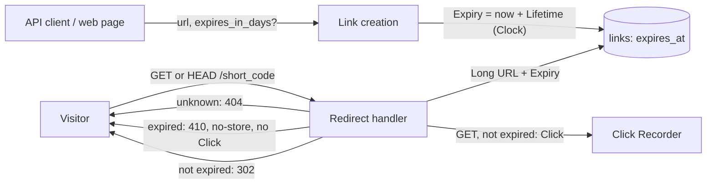

# Spec 0004: Expiring Links: an optional per-Link Lifetime, answered with `410 Gone` once it has passed

Glossary: `CONTEXT.md` · Decisions: ADR 0002, ADR 0003, ADR 0004, ADR 0005, ADR 0012, ADR 0014, ADR 0019 · Flows: `docs/architecture.md` · Roadmap: **R3** in `docs/roadmap.md` (the subject of the R23 clarification case study) · Issue: [#83](https://github.com/SanjuktaDavuluri/simple-url-shortener/issues/83)

## Problem Statement

Today every Link lives forever. Someone who shares a Short URL for a time-limited purpose, such as an event sign-up, a temporary download or a campaign, has no way to say "stop sending people there after this date". The Long URL may later go stale, change owner or become something they no longer want to point people at, and the Short URL keeps Redirecting to it from emails, documents and bookmarks they no longer control.

Issue #83 asked only that "Links should be able to expire". That sentence leaves the important decisions open, and each one touches an existing decision: what triggers expiry (the creation API and the schema), how an expired Short URL answers (the Redirect, ADR 0005, and spec 0001's `404`), whether a Short Code can ever name a new Link (Short Code generation and Collisions, ADR 0003), and what happens to Clicks (spec 0003, ADR 0012, and R2's stats, ADR 0014). They were settled on the Issue before this spec was written (see Further Notes).

## Solution

The person shortening a URL may give the Link an optional **Lifetime**: a whole number of days from 1 to 365. The service turns it into a fixed **Expiry**, a UTC time equal to the moment of creation plus the Lifetime, and stores it with the Link. A Link created without a Lifetime has no Expiry and never expires, so every existing Link and every existing client keeps working unchanged. Expiry depends only on time, never on Clicks.

Every Redirect checks the Expiry (ADR 0005's `302` keeps the shortener in the path of every visit, which is what makes this possible). Before its Expiry, a Link Redirects exactly as before and records a Click. From its Expiry on, it is an **Expired Link**: its Short URL answers **`410 Gone`** with a short readable body ("This link has expired.") and `Cache-Control: no-store`, `HEAD` gets the same answer, and **no Click is recorded**. Unknown Short Codes still get `404`.

An Expired Link **stays stored**. Its Short Code is **never reused**, so an old Short URL can never quietly start sending people somewhere else, and its Clicks are kept for auditing and R2. The only storage change is one nullable `expires_at` column on `links`. There's no background job and nothing is ever purged.

Both entry points offer the Lifetime: the JSON API takes an optional `expires_in_days` and returns the Link's `expires_at`, and the web page gains an optional "Expires after (days)" field that shows the Expiry with the result.

## User Stories

### Creating Links with a Lifetime: API

1. As an API client, I want to send an optional `expires_in_days` with the Long URL, so that the Link stops Redirecting after that many days.
2. As an API client, I want a request without `expires_in_days` (or with it set to `null`) to create a Link that never expires, so that my existing integration keeps working without a change.
3. As an API client, I want the `201` response to include the Link's `expires_at` as an ISO-8601 UTC time, or `null` when it never expires, so that I know exactly when the Short URL will stop working.
4. As an API client, I want an `expires_in_days` that isn't a whole number from 1 to 365 (zero, negative, over 365, a decimal, a string, a boolean) to fail with a `422` and an explanation, and no Link to be created, so that I can fix my request instead of getting a Link with a Lifetime I didn't intend.
5. As an API client, I want the existing `422` (Rejection Reason, malformed request) and `503` answers to stay exactly as they are, so that adding a Lifetime changes nothing else about creating Links.

### Creating Links with a Lifetime: web page

6. As a person using the web page, I want an optional "Expires after (days)" field next to the Long URL, so that I can create an expiring Link without using the API.
7. As a person using the web page, I want leaving that field blank to create a Link that never expires, so that the page works exactly as before if I ignore it.
8. As a person using the web page, I want the result to tell me when my Short URL expires (in UTC), so that I can tell the people I share it with.
9. As a person using the web page, I want an invalid number of days to be shown as an explanation under the field, with what I typed kept in both fields, so that I can correct it without starting over.
10. As a person using the web page, I want the field to work with and without JavaScript (ADR 0006), labelled for screen readers, so that the page stays accessible and keeps its Lighthouse scores.

### Following Links

11. As a person following the Short URL of a Link that hasn't expired, I want the Redirect to respond exactly as before (`302`, `Location`, `Cache-Control: no-store`), so that a Lifetime changes nothing until it has passed.
12. As a person following the Short URL of an Expired Link, I want a `410 Gone` saying "This link has expired.", so that I know the Link existed but has run out, rather than thinking I mistyped it.
13. As a person following the Short URL of an Expired Link, I want the `410` sent with `Cache-Control: no-store`, so that nothing between me and the shortener remembers the answer.
14. As an API client or monitoring tool, I want a `HEAD` request to an Expired Link to get the same `410` and headers without a body, so that I can check a Short URL without following it.
15. As a person following an unknown Short URL, I want the same `404` as before, so that expiry doesn't change what a Short Code that never existed looks like.
16. As a person following a Short URL, I want a Link to count as expired from the exact moment of its Expiry on, so that "expires at" means the same thing to everyone.
17. As a person following a Short URL, I want an Expired Link to keep answering `410` for as long as it exists, never Redirecting somewhere new, so that an old Short URL in an email or a bookmark can never be turned into a path to someone else's site.

### Short Codes, Clicks and storage

18. As the operator, I want no Click recorded when an Expired Link is followed, so that Click counts reflect only real Redirects (spec 0003).
19. As the operator, I want an Expired Link's Clicks kept, so that its history can still be audited and R2 can still report on it.
20. As the operator, I want a Short Code that names an Expired Link to be treated like any other taken Short Code (a Collision, so another is drawn), so that no Short Code is ever reused.
21. As the operator, I want every Link created before this change to keep Redirecting with no Expiry, so that upgrading the service doesn't break any Short URL already shared.
22. As the operator, I want expiry to need no background job, purge or new setting, so that there is nothing extra to run, schedule or tune.
23. As the operator, I want the Redirect to stay one database lookup, so that checking the Expiry doesn't slow down the hot path (ADR 0005, R13).

### Evidence

24. As an external reviewer, I want a written impact analysis of the modules, APIs and data flows this change touches, so that I can see the brownfield change was understood before it was built.
25. As an external reviewer, I want the clarification of Issue #83 (each question, its options, the recommendation and the answer) recorded next to this spec, so that I can follow how a one-line request became these requirements (R23).
26. As an external reviewer, I want each acceptance criterion traced to a test in the integration-testing plan's matrix, so that I can check every claim in this spec myself.

## Implementation Decisions

- **Lifetime (the value):** a whole number of days, 1 to 365 inclusive. A small value type validates it in one place, shared by the API and the web page. It is **not a Rule**: Rules check Long URLs only (ADR 0004, `CONTEXT.md`), so an invalid Lifetime is a validation message, not a Rejection Reason.
- **Expiry:** `creation instant + Lifetime × 24 hours`, an `Instant` in UTC, taken from the injected `java.time.Clock` (the same bean the Click uses; `TestClock` in tests). It is fixed when the Link is created and never changes. Days are exact 24-hour periods in UTC, with no calendar or time-zone arithmetic.
- **Expired:** a Link is expired at instant `now` when it has an Expiry and `now >= Expiry`. The comparison is made in Java against the injected Clock, not in SQL, so tests can move time forward.
- **Link creation (`LinkService`):** gains an optional Lifetime, and stays the single create path for both entry points (spec 0001). Order: trim the Long URL, check the Rule Set, then draw Short Codes and save with the Expiry. Collision handling and the 5-attempt limit are unchanged (ADR 0003). The returned `Link` carries its Expiry (optional).
- **Link Store:**
  - *Save a Link* takes the Expiry (optional) as well as the Short Code and Long URL, and still fails distinctly when the Short Code is taken. Expired Links stay in `links`, so the primary key keeps refusing their Short Codes with no extra code.
  - The Redirect lookup becomes *get the Long URL and Expiry for a Short Code, or nothing*: one query by primary key, replacing *get the Long URL*. No operation deletes or lists Links.
- **Schema (Flyway `V3__add_link_expiry.sql`):** `ALTER TABLE links ADD COLUMN expires_at TEXT` (nullable, ISO-8601 UTC in the same format as `created_at`, e.g. `2026-11-07T10:15:30.123Z`). Existing rows get `NULL`, meaning "never expires". No index: the column is only read through the primary-key lookup. `clicks` is untouched.
- **Redirect handler (`LinkController.followLink`):** for `GET` and `HEAD`:
  - unknown Short Code → `404`, unchanged;
  - Link not expired → the same `302` as before, then one Click on `GET`, unchanged (spec 0003);
  - Expired Link → `410 Gone`, `Content-Type: text/plain;charset=UTF-8`, `Cache-Control: no-store`, body `This link has expired.` (no body for `HEAD`). It records **no Click** and never calls the Click Recorder.
  The handler stays the single point that Redirects and produces Clicks (ADR 0005).
- **API contract:**
  - `POST /links` with JSON `{"url": "<Long URL>", "expires_in_days": <1–365, optional>}`:
    - `201` → `{"short_code": "Ab3xK9q", "short_url": "<Base URL>/Ab3xK9q", "long_url": "<as stored>", "expires_at": "2026-11-07T10:15:30.123Z" | null}`. `expires_at` is always present, `null` for a Link that never expires.
    - `422` → validation message `"expires_in_days must be a whole number of days from 1 to 365."` when `expires_in_days` is present, not `null`, and isn't a JSON integer in range. Strings such as `"30"`, decimals such as `1.5`, and booleans are rejected, never coerced. A request that has both a bad `url` and a bad `expires_in_days` gets the malformed-request message first. The Lifetime is checked before the Rule Set, like the rest of the request shape.
    - All other `422` and `503` answers are unchanged.
  - `GET /{short_code}` → `302` (unchanged), `404` (unchanged), or `410` as above.
- **Web page:** the shortener fragment gains an optional number field `expires_in_days` labelled "Expires after (days)" with the hint "Leave blank to keep the link forever" (`min=1`, `max=365`, `inputmode=numeric`). The form keeps `novalidate`, so the server is the only judge. Blank → never expires. Invalid → `422` with the validation message under the field (`aria-invalid`, `aria-describedby`, `role="alert"`), both typed values kept. On success the result shows "Expires on 2026-11-07 10:15 UTC" under the Short URL, or nothing for a Link that never expires. One template serves the full page and the HTMX fragment, as now (ADR 0006). No new JavaScript.
- **Configuration:** none. The 1–365 range is a constant in the Lifetime type; making it configurable can come later if it's needed.
- **Logging:** no per-request logging of expired Redirects. Long URLs are never logged (ADR 0013, ADR 0015).

## Impact Analysis

This is a brownfield change to the creation path, the Redirect (the hot path, ADR 0005) and the `links` schema.

### Modules

| Module | Change | Risk and how it's contained |
|---|---|---|
| `LinkController.followLink` (Redirect) | **Changed:** reads the Expiry with the Long URL; answers `410` for an Expired Link | Hot path. Still one primary-key lookup. The existing Redirect and Clickstream tests stay unchanged and must still pass |
| `LinkController.createLink`, `CreateLinkRequest`, `CreatedLink` | **Changed:** optional `expires_in_days` in, `expires_at` out | Additive field. Existing request/response tests stay unchanged apart from the new `expires_at: null` |
| `LinkService`, `Link` | **Changed:** optional Lifetime in, Expiry out; Expiry from the injected Clock | Shared by both entry points, so they can't drift. Collision logic untouched |
| `LinkStore`, `JdbcLinkStore` | **Changed:** save takes the Expiry; the Redirect lookup returns Long URL and Expiry | The only module touching `links` (ADR 0002). Covered by the existing persistence and Collision tests |
| `Lifetime` (new value type) | **New** | Pure, unit-tested |
| Flyway migrations | **New** `V3__add_link_expiry.sql` | Additive nullable column. Existing databases (the maintainer's `.local/`) migrate forward on start, with every existing Link set to never expire |
| `PageController`, `fragments/shortener.html`, CSS | **Changed:** the Lifetime field, its error and the Expiry in the result | Browser checks and Lighthouse (≥ 90) guard layout and accessibility |
| `rules`, `ShortCodeGenerator`, `clicks` package, Click Recorder, Click Store | **Unchanged** | Their tests are the regression check |

### APIs

- **`POST /links`:** one optional request field and one new response field. Clients that ignore unknown fields are unaffected. A client that sends no Lifetime gets the same behaviour as before.
- **`GET /{short_code}`:** a new `410 Gone` status. Nothing changes for Links that never expire or haven't expired yet.
- **Web page:** one optional field; the form posts to the same route.
- **Internal interfaces:** `LinkStore` changes signature (save and lookup); `ClickRecorder` and `ClickStore` are unchanged.
- **Configuration surface:** unchanged.

### Data flows

- **New data stored:** one ISO-8601 timestamp (about 24 bytes) on Links that have a Lifetime; `NULL` otherwise.
- **Data kept forever:** Expired Links and their Clicks stay stored. Storage grows exactly as it does today; expiry neither adds nor frees rows.
- **Time:** Expiry is computed from the application's Clock, while `created_at` still comes from SQLite's default. Both are UTC; the Expiry is the one that matters.

### Downstream roadmap items and decisions

- **R2** (Click counts, stats API, ADR 0014): an Expired Link's Clicks are all from before its Expiry. R2 decides whether its stats show the Expiry and the expired state; nothing here stops the creator from reading them.
- **R4** (edit / delete): deleting a Link, and its Clicks, stays there. It should keep Short Codes from being reused, in line with story 17.
- **R12** (operability, ADR 0015): `410`s show up in the HTTP server metrics by status with no extra code. A dedicated "expired Redirects" counter can be added there if wanted.
- **R13** (load testing): Redirect latency is still measured on one primary-key lookup; adding a mix of Expired Links to the load test is enough.
- **R21** (OpenAPI): the contract gains `expires_in_days`, `expires_at` and the `410`.
- **ADR 0019 stage 3** (Redirect cache): Expiry is fixed at creation, so Links stay immutable. A cache can hold the Long URL and Expiry and compare against the clock on every hit, with no invalidation.
- **R19** (rate limiting): unaffected; creating a Link costs the same with or without a Lifetime.

### Documents to update with the tickets

`docs/architecture.md` (the Redirect flow with the `410` branch, the creation flow with the Lifetime), `CONTEXT.md` (Lifetime, Expiry, Expired Link), `docs/plans/0001-integration-testing.md` (matrix rows), `docs/onboarding.md` (the API example), `README.md`, the spec index, and the R3 row of `docs/roadmap.md`.

## Testing Decisions

- **What makes a good test here:** as in specs 0001 and 0003, tests exercise external behaviour through a seam, use glossary terms in their names, and never assert on SQL. Expected values come from this spec, not recomputed the way the code computes them (e.g. a fixed clock at `2026-10-08T10:00:00Z` and a Lifetime of 30 gives `2026-11-07T10:00:00Z`, written out literally).
- **Seam 1: HTTP surface (existing), with `TestClock`.**
  - Creation: no Lifetime, `null`, 1 and 365 succeed with the expected `expires_at` (or `null`). `0`, `-1`, `366`, `1.5`, `"30"`, `true`, `{}` each give the `422` validation message, and no Link is created (the scripted Short Code isn't used). A bad `url` with a valid Lifetime keeps today's messages.
  - Redirect boundaries: one millisecond before the Expiry → `302`; exactly at the Expiry → `410`; long after → `410`. Check the status, `Content-Type`, `Cache-Control: no-store` and body, and the same for `HEAD` without a body.
  - Unknown Short Code → `404`, and a Link without a Lifetime still Redirects a long time later (clock advanced 10 years).
- **Seam 2: Lifetime (plain JUnit 5).** Valid and invalid values in, Lifetime or validation message out; Expiry from a fixed instant.
- **Seam 3: Click Store (from spec 0003).** After `flush()`, following an Expired Link (`GET` and `HEAD`) stores no Click; following it before its Expiry stores exactly one; an Expired Link's earlier Clicks are still listed after it expires.
- **Collision:** with the scripted generator, a Short Code that names an Expired Link is drawn again (a Collision), and the new Link gets the next scripted code; the Expired Link still answers `410`.
- **Persistence and migration (`TestApps`):** the Expiry survives a restart on the same database file. V3 applies to a Release 2 database containing Links and Clicks, and those Links still Redirect with `expires_at` `null`.
- **Web page (existing seam, with and without HTMX):** the field is present and labelled; a blank field gives a Link that never expires and no Expiry line; a valid value shows "Expires on … UTC"; an invalid value gives `422`, the message under the field with `aria-invalid`, and both values kept.
- **Browser checks (`e2e/`):** create an expiring Link through the page, with and without JavaScript; Lighthouse stays ≥ 90 in every category (median of 3 runs).
- **Not tested here:** Redirect latency under load (R13) and database faults (R14).
- **Prior art:** `TestClock` and `ClickstreamIT` (moving time, observing Clicks), `CollisionIT` and `ScriptedShortCodeGenerator`, `PersistenceIT` and `TestApps`, `LinkApiIT`, `WebPageIT` and `WebPageHtmxIT`.
- **Plan and matrix:** every ticket's PR adds its rows to the traceability matrix in `docs/plans/0001-integration-testing.md`.
- **Process:** every ticket is built test-first (red → green → refactor) with the `tdd` skill. `./mvnw verify` stays the single entry point.

## Out of Scope

- Expiry triggered by Clicks (a Click limit) or by inactivity. Click recording is asynchronous and drops Clicks under load (ADR 0012), so a Click limit couldn't be enforced exactly.
- A service-wide default or maximum Lifetime applied to every Link; Lifetimes in units other than whole days; an exact expiry date and time chosen by the client.
- Changing, extending or removing a Link's Expiry after creation, or expiring a Link early (R4).
- Deleting Expired Links or their Clicks, purge jobs, and Click retention (R4, spec 0003's retention note).
- Reusing Short Codes of Expired Links, in any form.
- A styled HTML "expired" page, or a `302` to one.
- Showing the Expiry in the visitor's local time zone.
- Stats for Expired Links (R2).

## Further Notes

- **How the requirement was clarified (R23):** Issue #83 said only "Links should be able to expire". Three questions were asked on the Issue, one at a time, each with options and a recommendation, and answered by the maintainer (SanjuktaDavuluri):
  1. *What triggers expiry?* Options: a per-Link expiry chosen at creation; one service-wide lifetime; a Click limit; inactivity. **Answer:** an optional per-Link expiry set at creation as a whole-day Lifetime (1–365 days), stored as a fixed UTC time; Links without one never expire.
  2. *How does an Expired Link's Short URL answer?* Options: `410 Gone`; `404` like an unknown Short Code; `302` to an "expired" page. **Answer:** `410 Gone` with a short readable body and `Cache-Control: no-store`; `HEAD` the same; no Click recorded. ADR 0014's reason for `404` (not confirming which Short Codes exist to someone guessing at the stats endpoint) doesn't apply to someone who was given the Short URL.
  3. *What happens to an Expired Link in storage, and can its Short Code be reused?* Options: keep it, retire its Short Code, keep its Clicks; delete it after a grace period and reuse the Short Code; delete it and its Clicks but keep a list of retired Short Codes. **Answer:** keep Expired Links stored, never reuse their Short Codes, keep their Clicks. Reuse would let an old Short URL quietly point at someone else's Long URL, and ADR 0003's 62^7 space makes reuse unnecessary.
- **Decided while writing this spec, all easy to change:** the field names `expires_in_days` and `expires_at`; `expires_at` always present (`null` when there's no Expiry); a Link counts as expired from the exact instant of its Expiry; days are exact 24-hour periods in UTC; a plain-text `410` body; the 1–365 range fixed in code, not configuration; the web page's free number field (rather than a list of preset Lifetimes) and showing the Expiry in UTC; the Lifetime checked before the Rule Set.
- **Candidate ADR for the design stage:** *Expired Links are kept and their Short Codes are never reused.* It is hard to reverse (once a Short Code has been reused, old Short URLs already point at the new Link and that can't be undone), surprising without context (expiry that never frees anything), and a real trade-off (unbounded growth of `links` against a phishing path through stale Short URLs). It also constrains R4's delete. Recording it is a design-stage decision that needs the maintainer's approval. The `410`-versus-`404` choice is explained above and in story 12; it probably doesn't need its own ADR.
- **Glossary candidates** for `CONTEXT.md`:
  - **Lifetime:** the whole number of days, 1 to 365, that the person shortening a URL may give a Link when creating it. _Avoid_: TTL, duration, validity.
  - **Expiry:** the fixed UTC time a Link stops Redirecting: its creation time plus its Lifetime. A Link created without a Lifetime has none and never expires. _Avoid_: expiration date, deadline, TTL.
  - **Expired Link:** a Link whose Expiry has passed. It stays stored, its Short Code is never reused, and its Short URL answers `410 Gone` instead of Redirecting. _Avoid_: dead link, deleted link, inactive link.
- **Status lifecycle:** `draft → accepted → in-progress → implemented`. Set it to `in-progress` when the first ticket starts and to `implemented` when the last ticket's work is merged. Add the spec to the index in `docs/specs/README.md` when it is accepted, and move R3 to `planned` on the roadmap.
