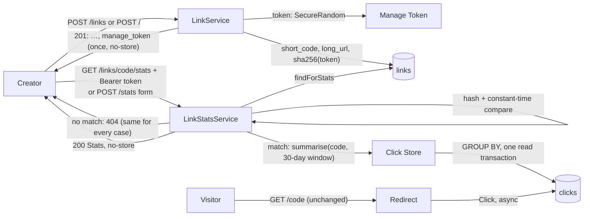

# Spec 0005: Click stats per Link: the creator can see how a Link is used

Glossary: `CONTEXT.md` · Decisions: ADR 0002, ADR 0006, ADR 0012, ADR 0013, ADR 0014, ADR 0021 · Builds on: spec 0003 (Clickstream) · Flows: `docs/architecture.md` · Roadmap: **R2** in `docs/roadmap.md` · Issue: [#95](https://github.com/SanjuktaDavuluri/simple-url-shortener/issues/95)

## Problem Statement

Since R10 (spec 0003), every successful Redirect stores a Click. But nobody can see them: there is no read path over HTTP, so the person who created a Link has no idea whether it is being followed, when, from which sites, or on which devices. That analytics is the reason the shortener keeps itself in the path of every visit with a `302` (ADR 0005).

How a Link is used is the creator's business, not the business of everyone the Short URL was shared with (ADR 0014). The shortener has no user accounts (R8: won't do), so today it can't tell the creator apart from anyone else who knows the Short Code.

## Solution

**Creating a Link returns a Manage Token**, a high-entropy random secret, **once**: in the JSON API's create response as a new `manage_token` field, and on the web page's result panel with a copy button and a "keep this safe" note. The shortener stores only a one-way hash of it, so a lost token can't be recovered, and a database leak doesn't give the tokens away (ADR 0014).

The creator reads the Link's **Stats** with that token:

- **JSON API:** `GET /links/{short_code}/stats` with `Authorization: Bearer <manage_token>`.
- **Web page:** a "Link stats" page at `/stats` with a form for the Short Code (or Short URL) and the Manage Token, sent with `POST`, never in the URL. With HTMX it updates in place, and it also works without JavaScript (ADR 0006).

A missing, malformed or wrong token, an unknown Short Code, and a Link created before this change (which has no token) all get the **same `404`**. The endpoint never confirms which Short Codes exist (ADR 0014).

The Stats report on the minimal Click data only (ADR 0013):

- the **headline Click count**, with bot Clicks excluded
- the **bot Click count**
- the time of the **last Click**
- **Clicks per day** for the last 30 UTC days
- the breakdown by **Agent Category**
- the breakdown by **Device Class**
- the **top 10 Referrer Hosts**, plus the number of Clicks with no Referrer Host

Clicks are recorded asynchronously (ADR 0012), so the Stats can trail the Redirects by about one flush interval and never include dropped Clicks. Each response says when it was computed, and the page says that counts may lag a little.

The change is additive. Existing create-response fields, status codes and the Redirect are unchanged, so current API clients keep working.

## User Stories

### Creating a Link (brownfield change to the create path)

1. As an API client creating a Link, I want the `201` response to carry a `manage_token` next to the fields it already has, so that I can read the Link's Stats later.
2. As an existing API client, I want every existing create-response field, status code and error to stay exactly as it was, so that the new field doesn't break me.
3. As a person shortening a URL on the web page, I want the result panel to show my Manage Token once, with a copy button and a note to keep it safe, so that I can save it before I leave.
4. As a person shortening a URL on the web page, I want a "See its stats" link next to my Short URL that opens the Stats page with the Short Code already filled in (never the token), so that I know where to use the token.
5. As a Link creator, I want every Link to get its own Manage Token, different from every other, so that one token never opens another Link's Stats.
6. As a Link creator, I want the token stored only as a one-way hash, so that someone who reads the database still can't open my Stats.
7. As a Link creator, I want the response that shows my token not to be cached (`Cache-Control: no-store`), so that it isn't kept by a browser or proxy cache.

### Reading Stats

8. As a Link creator, I want to fetch my Link's Stats over the JSON API with my token in an `Authorization: Bearer` header, so that a script or dashboard can read them.
9. As a Link creator, I want to see my Link's Stats on the web page by entering its Short Code (or Short URL) and my token in a form, so that I don't need any tools.
10. As a Link creator, I want the headline count to leave out bot Clicks, and the bot Clicks shown on their own, so that I see how many people followed my Link (ADR 0013).
11. As a Link creator, I want Clicks per day for the last 30 UTC days, including days with none, so that I can see the trend over time.
12. As a Link creator, I want the split by Agent Category (`browser`, `other`, `bot`), so that I can see how much traffic is people, tools and bots.
13. As a Link creator, I want the split by Device Class (`desktop`, `mobile`), so that I know where my audience reads.
14. As a Link creator, I want the top 10 Referrer Hosts and the number of Clicks with no Referrer Host, so that I know which sites send traffic and how much comes directly.
15. As a Link creator, I want the time of the last Click, so that I can tell whether the Link is still in use.
16. As a Link creator, I want the Stats to show their Short Code, Short URL, Long URL and creation time, so that I know which Link I'm looking at.
17. As a Link creator, I want a Link with no Clicks yet to show zeros and an empty list, not an error, so that a new Link looks normal.
18. As a Link creator, I want to know that counts can trail recent Redirects by a moment, through a `generated_at` time in the API and a note on the page, so that a just-made Click missing from the count doesn't look like a bug (ADR 0012).

### Privacy and security

19. As a Link creator, I want anyone without my token to get a `404`, so that my Link's usage stays private (ADR 0014).
20. As a Link creator, I want an unknown Short Code, a Link without a token, a missing or malformed `Authorization` header and a wrong token all to get exactly the same `404`, so that the endpoint can't be used to find out which Short Codes exist.
21. As a Link creator, I want my token never to appear in a URL, a log line or an error message, so that it can't leak through logs, browser history or `Referer` headers (ADR 0014).
22. As a Link creator, I want the token checked in constant time against its stored hash, so that response timing doesn't reveal how close a guess was.
23. As a person following a Short URL, I want the Stats to contain no IP address, raw user agent or full referrer URL, and no unique visitors or geography, so that the creator learns nothing personal about me (ADR 0013).
24. As a Link creator, I want Stats responses not to be cached (`Cache-Control: no-store`), so that they aren't kept by a shared cache.

### Unchanged behaviour

25. As a person following a Short URL, I want the Redirect to behave exactly as before (status, headers, recording a Click), so that Stats change nothing for me.
26. As the owner of a Link created before this change, I want it to keep Redirecting as before. Its Stats are available to nobody until a token can be issued (R4, ADR 0014).

### Evidence

27. As an external reviewer, I want a written impact analysis of the modules, APIs and data flows this change touches, so that I can see the brownfield change was understood before it was built.
28. As an external reviewer, I want an API contract for the new endpoint and the changed create response, so that I can check the behaviour against something written down.
29. As an external reviewer, I want each acceptance criterion traced to a test in the integration-testing plan's matrix, so that I can check every claim in this spec myself.

## Implementation Decisions

- **Manage Token:** 32 bytes from `SecureRandom`, encoded as unpadded base64url (43 characters). Generated in `LinkService.create`, once per Link, only after the Rule Set has passed. Behind a small `ManageTokenGenerator` interface, so tests can script it the way `ScriptedShortCodeGenerator` scripts Short Codes.
- **Token hash:** SHA-256 of the token's UTF-8 bytes, stored as lower-case hex. A fast hash is enough here because the token is 256 bits of randomness, not a human-chosen password: there is nothing to brute-force from a dictionary. A slow password hash (bcrypt, Argon2) would add latency to every Stats read and gain nothing. Comparison uses `MessageDigest.isEqual` on the hashes, which is constant-time. When the Link is unknown or has no hash, the presented token is still hashed and compared against a fixed dummy hash, so that response time doesn't reveal whether the Short Code exists. (Candidate ADR: see Further Notes.)
- **Link (the value):** gains `manageToken`. It holds the token in plain text only in memory, between creation and the response. It is never logged, and `toString` must not print it.
- **Link Store:** `save(shortCode, longUrl, manageTokenHash)` replaces `save(shortCode, longUrl)`. A new `findForStats(shortCode)` returns the stored Link (Short Code, Long URL, `created_at`, Manage Token hash, which may be absent) if it exists. `findLongUrl` is unchanged, so the Redirect path is untouched.
- **Schema (Flyway `V4__add_manage_token_hash.sql`):** `ALTER TABLE links ADD COLUMN manage_token_hash TEXT`, nullable. Existing rows get `NULL` and have no Stats access (ADR 0014). There is no index: lookups go by `short_code`, the primary key.
- **Click Store:** gains one read operation, `summarise(shortCode, Instant windowStart)`. It returns a Click Summary: counts by Agent Category; and, over non-bot Clicks only, counts by Device Class, the top 10 Referrer Hosts (by count descending, then by host ascending), the count with no Referrer Host, counts per UTC day from `windowStart`, and the latest `clicked_at`. `JdbcClickStore` computes it with `GROUP BY` queries over the `(short_code, clicked_at)` index, inside one read transaction, so all the numbers come from the same snapshot (WAL, ADR 0021). The Click Store stays the only code that reads `clicks` (spec 0003, story 24). `listClicks` stays as the audit read and the test seam. Stats are aggregated in SQL rather than by listing every Click because a busy Link's Clicks would otherwise all be loaded into memory on each request.
- **Link Stats service (new, `stats` package):** `LinkStatsService.statsFor(shortCode, presentedToken)` returns `Optional<LinkStats>`. Empty means "`404`", with no reason given, for all the cases in story 20. It checks the token first and touches the Click Store only after a match. It builds the 30-day window from the injected `Clock`: today in UTC and the 29 days before it, oldest first, with days that have no Clicks filled with zero. The JSON API and the web page both use this service; neither implements Stats itself (ADR 0006).
- **Headline count:** `clicks` = `browser` + `other`. Bots are excluded from the headline, the per-day series, the Device Class split, the Referrer Hosts and the last-Click time, and are reported only as `bot_clicks` and in `by_agent_category` (ADR 0013). `clicks` counts every non-bot Click ever stored, not just those in the 30-day window.
- **JSON endpoint:** a new `LinkStatsController` (or a handler next to `LinkController`), `GET /links/{shortCode:[A-Za-z0-9]{7}}/stats`. It parses `Authorization` case-insensitively for the `Bearer` scheme. Any other path shape falls through to Spring's normal `404`.
- **Web page:**
  - `GET /stats` renders the Stats form. An optional `short_code` query parameter only pre-fills the Short Code field; a token is never read from the query string.
  - `POST /stats` (form-encoded `short_code`, `manage_token`) renders the Stats, or a `404` with the message "No stats found for that Short Code and manage token."
  - The Short Code field accepts a bare Short Code or a Short URL that starts with the Base URL; the Short Code is taken from the end.
  - It uses the same template-and-fragment pattern as the shortener (`fragments/stats`), so HTMX requests get only the fragment. The htmx `responseHandling` config swaps `404` for this form.
  - Clicks per day appear as an accessible table: the date and the count. A bar per day is drawn with CSS only, with no chart library and no inline script (R20's planned CSP).
  - The token field is `type="password"` with `autocomplete="off"`.
- **Create result panel:** shows the Manage Token in a read-only field with a copy button (reusing `copy.js`) and the note "Keep this safe: it's the only way to see this Link's stats, and it won't be shown again." It also shows the "See its stats" link to `/stats?short_code=<code>`.
- **Caching:** `Cache-Control: no-store` on the `POST /links` and `POST /` responses (they carry the token) and on every Stats response (JSON and page, success and `404`).
- **Logging:** nothing new at request level. The `Authorization` header, the `manage_token` form field and the token hash are never logged. Error messages never include them.

## API Contract

### `POST /links` (changed: one field added)

Request: unchanged, `{"url": "https://example.com/some/long/path"}`.

`201 Created`, `Cache-Control: no-store`:

```json
{
  "short_code": "Ab3xK9q",
  "short_url": "http://localhost:8000/Ab3xK9q",
  "long_url": "https://example.com/some/long/path",
  "manage_token": "q0Vx3k2c9yJm1bT8wR4uLpA7sD6fG5hN2jK8mZ1xC0v"
}
```

`manage_token` is returned in this response only and can't be fetched again. Errors (`422` Rejection Reason or malformed body, `503` no free Short Code) are unchanged and carry no token.

### `GET /links/{short_code}/stats` (new)

Request header: `Authorization: Bearer <manage_token>`.

`200 OK`, `Content-Type: application/json`, `Cache-Control: no-store`:

```json
{
  "short_code": "Ab3xK9q",
  "short_url": "http://localhost:8000/Ab3xK9q",
  "long_url": "https://example.com/some/long/path",
  "created_at": "2026-10-01T09:15:02.123Z",
  "generated_at": "2026-10-08T12:00:00.000Z",
  "clicks": 42,
  "bot_clicks": 7,
  "last_click_at": "2026-10-08T11:58:41.004Z",
  "clicks_per_day": [
    {"date": "2026-09-09", "clicks": 0},
    "... 30 entries, oldest first, ending with today (UTC) ...",
    {"date": "2026-10-08", "clicks": 5}
  ],
  "by_agent_category": {"browser": 38, "other": 4, "bot": 7},
  "by_device_class": {"desktop": 30, "mobile": 12},
  "top_referrer_hosts": [
    {"host": "news.example.com", "clicks": 20},
    {"host": "t.co", "clicks": 9}
  ],
  "no_referrer_host": 13
}
```

| Field | Meaning |
|---|---|
| `clicks` | Headline count: every stored non-bot Click (`browser` + `other`), all time |
| `bot_clicks` | Every stored `bot` Click, all time |
| `last_click_at` | Time of the latest non-bot Click; `null` if there is none |
| `clicks_per_day` | Exactly 30 entries, one per UTC date, oldest first, ending today; non-bot Clicks; zero-filled |
| `by_agent_category` | All three keys always present; `browser` + `other` = `clicks`, `bot` = `bot_clicks` |
| `by_device_class` | Both keys always present; non-bot Clicks; sums to `clicks` |
| `top_referrer_hosts` | At most 10, by `clicks` descending, then `host` ascending; non-bot Clicks |
| `no_referrer_host` | Non-bot Clicks without a Referrer Host |
| `generated_at` | When these Stats were computed. Clicks from about the last flush interval may not be included yet (ADR 0012) |

Times are ISO-8601 UTC to the millisecond, as in `links.created_at`.

`404 Not Found`, `Cache-Control: no-store`, `application/problem+json` with the same body in every case: `{"type": "about:blank", "title": "Not Found", "status": 404, "detail": "No stats found for this Short Code."}`. It is returned when:

- the Short Code is unknown
- the Link has no Manage Token (created before this change)
- `Authorization` is missing, is not `Bearer`, or is empty
- the token doesn't match

The status line, headers and body are byte-for-byte the same in every case.

Not offered: unique visitors, geography, raw referrers or user agents (ADR 0013), pagination, or custom date ranges.

### Web page (new routes)

| Route | Answer |
|---|---|
| `GET /stats[?short_code=…]` | `200`: the Stats form, with the Short Code pre-filled if given |
| `POST /stats` (form: `short_code`, `manage_token`) | `200`: the Stats; or `404`: the form again with "No stats found for that Short Code and manage token." (same for every failure in story 20). The fragment only if `HX-Request` is set |

## Impact Analysis

This is a brownfield change to the create path (JSON API and web page) and the `links` schema. It adds the first HTTP read path over Clicks. The Redirect path is not changed.

### Modules

| Module | Change | Risk and how it's contained |
|---|---|---|
| `LinkService.create` | **Changed:** generates a Manage Token, hashes it, saves the hash with the Link | The single create path for both entry points (ADR 0006). Existing create tests must pass unchanged apart from the new field |
| `Link` | **Changed:** carries `manageToken` | Plain text in memory only. A test proves it isn't in `toString` or the logs |
| `LinkStore`, `JdbcLinkStore` | **Changed:** `save` takes the hash; new `findForStats` | `findLongUrl` (the Redirect read) is untouched. Collision handling is unchanged |
| `LinkController.createLink` | **Changed:** adds `manage_token` and `Cache-Control: no-store` | Additive. The API tests from Release 1 are the regression check |
| `PageController.shorten`, `fragments/shortener.html`, `app.css` | **Changed:** the result panel shows the token, copy button, note and "See its stats" link | Browser checks (Playwright) and Lighthouse (≥ 90) must stay green |
| `ClickStore`, `JdbcClickStore` | **Changed:** new `summarise` operation | Read-only. `saveAll` and `listClicks` are unchanged. One read transaction under WAL never blocks the Click writer (ADR 0021) |
| `ManageTokenGenerator`, `ManageTokens` (hash and compare), `LinkStatsService`, `LinkStats`, Click Summary, `LinkStatsController`, `StatsPageController`, `index`/`fragments/stats.html` templates | **New** | Isolated; unit- and integration-tested |
| Flyway migrations | **New** `V4__add_manage_token_hash.sql` | Additive, nullable column. Release 1 and R10 databases (the maintainer's `.local/`) migrate forward on start |
| `LinkController.followLink`, `ClickRecorder`, `QueuedClickRecorder`, `ClickClassifier`, `rules` | **Unchanged** | Their tests are the regression check |
| Test harness (`IntegrationTest`, `TestApps`) | **Changed:** a scripted `ManageTokenGenerator` in the shared context; a helper that creates a Link and returns its token | Plan 0001 principles 2 and 3 keep holding |

### APIs

- **`POST /links`:** one new response field (`manage_token`) and a new `Cache-Control: no-store` header. Nothing removed or renamed, and no status code changes. It is backwards compatible for clients that ignore unknown fields. A client that rejects unknown fields would break; the API has never promised a closed schema, and R21 will document the field.
- **`GET /links/{short_code}/stats`:** new (contract above).
- **Web page:** the create result gains the token panel; new `/stats` routes. `GET /` and the shortener form are otherwise unchanged.
- **`GET /{short_code}` (Redirect):** unchanged.
- **Internal interfaces:**
  - `LinkStore.save` changes signature, its only caller being `LinkService`, and `findForStats` is new.
  - `ClickStore.summarise` is new.
  - `ManageTokenGenerator` is new.
- **Configuration surface:** unchanged. No new settings.

### Data flows



- **New data stored:** one `manage_token_hash` (64 hex characters) per new Link. No personal data: the token identifies a capability, not a person.
- **New data read:** the Clicks of one Link, aggregated, only after the token matches. No new data is read from visitors.
- **Secrets in transit:**
  - The token travels in the create response body, the `Authorization` header, or a `POST` form body; never in a URL.
  - Over plain `http` (local runs) it can be observed on the network. Deployments must serve over HTTPS.
  - This is noted in the runbook (R12) and is the deployer's concern, not this spec's.
- **Consistency:** Stats come from stored Clicks only. They trail Redirects by up to about one flush interval (`CLICK_FLUSH_INTERVAL`, default `1s`) under normal load and never include dropped Clicks (ADR 0012).
- **Load:** each Stats request runs a handful of indexed `GROUP BY` queries over one Link's Clicks. The `(short_code, clicked_at)` index from V2 serves them. Stats reads are read-only and, under WAL, never wait for the Click writer or for Link creation.

### Downstream roadmap items

- **R3 / spec 0004 (expiring Links, draft):** an Expired Link keeps its Clicks and its Manage Token. Whether Stats show the Expiry is R3's to decide. Spec 0004 added the V3 migration (`expires_at`) first, so this spec's migration is V4.
- **R4 (edit/delete):** the Manage Token is its intended authority, and reissuing a lost token (or issuing one for older Links) belongs there (ADR 0014).
- **R12 (operability):** documents in the runbook that tokens and `Authorization` headers must never be logged, and that HTTPS is required for the token to stay secret.
- **R19 (rate limiting):** must cover `GET /links/{code}/stats` and `POST /stats` (ADR 0014). Until then, guessing a 256-bit token is infeasible, but the endpoint is not throttled.
- **R20 (CSP):** the Stats page uses no inline script or style, so it already fits the planned strict policy.
- **R21 (OpenAPI):** documents `manage_token`, the stats endpoint and the Bearer scheme from this contract.
- **Plan 0001, P8:** the HTTP-level Click assertions can now move from the Click Store seam to the stats API (spec 0003, Further Notes).

### Documents to update with the tickets

- `docs/architecture.md`: the Stats flow and the create flow with the token
- `CONTEXT.md`: Manage Token, Stats, headline Click count
- `docs/plans/0001-integration-testing.md`: a new P9 phase for Stats, the scripted Manage Token generator, matrix rows and spec 0005 coverage
- `docs/onboarding.md`: how to try Stats locally
- `README.md`
- the spec index
- the R2 row of `docs/roadmap.md`

## Testing Decisions

- **What makes a good test here:** as in specs 0001 and 0003, tests exercise external behaviour through a seam, use glossary terms in their names and never assert on SQL. Expected numbers are written out from the scenario, not recomputed the way the code computes them.
- **Seam 1: HTTP surface (integration, `*IT`).** Clicks are produced by real Redirects with chosen `Referer` and `User-Agent` headers, then `flush()` on the Click Recorder (ADR 0012: flush, don't sleep), then Stats are read over HTTP. The clock is fixed, so the 30-day window is deterministic.
  - **Create:** the `201` has `manage_token` (the scripted value), every existing field is unchanged, and there is `Cache-Control: no-store`. Two Links get different tokens. `422`/`503` responses carry no token.
  - **Stats with the right token:** totals, bot exclusion, Agent Category and Device Class splits, top Referrer Hosts (with ordering and the cut at 10), `no_referrer_host`, `last_click_at`, and 30 zero-filled days. Clicks at both edges of the window (29 days ago is in, 30 days ago is out of the series but in `clicks`). A Link with no Clicks. Two Links' Stats stay separate.
  - **The same `404`:** unknown Short Code, a Link inserted without a hash (a pre-R2 Link via the V4 migration test), no header, a non-Bearer scheme, an empty token, the wrong token, another Link's token. Each must equal the first case byte for byte.
  - **Privacy:** the Stats body contains none of the raw `Referer` or `User-Agent` values sent. The token appears in no captured log output (`OutputCaptureExtension`) across create, Stats success and `404`.
  - **Redirect unchanged:** the Release 1 and spec 0003 Redirect tests pass unchanged.
- **Seam 2: web page (integration, MockMvc/HTTP).**
  - The create result shows the token, the note and the "See its stats" link (Short Code only).
  - `POST /stats` with a good token renders the Stats; with a bad one, `404` and the message.
  - A Short URL in the Short Code field works.
  - HTMX requests get the fragment; plain requests get the full page.
  - `GET /stats?manage_token=…` never uses the token.
- **Seam 3: Click Store `summarise` (integration).** Through `saveAll` with hand-built Clicks: the counts per group, the top-10 cut and tie-break, the window start, and an empty result for an unknown Short Code.
- **Seam 4: unit tests (plain JUnit 5).**
  - `ManageTokens`: hashing gives the known SHA-256 hex of a fixed token; matching and non-matching comparisons; the dummy-hash path.
  - `RandomManageTokenGenerator`: 43 base64url characters; no repeats over many draws.
  - `LinkStatsService` with stand-ins: zero-filling, window boundaries in UTC, the `404` cases.
- **Migration:** V4 applies to an empty database (proven before every test) and to an R10 database containing Links and Clicks. Old Links keep Redirecting and their Stats are `404`.
- **Browser checks (`e2e/`, Playwright):**
  - Create a Link on the page, copy the token, open "See its stats", enter the token, see the Stats.
  - The token is not in the page URL at any point.
  - Lighthouse on `/stats` scores ≥ 90 (median of 3).
- **Not tested here:** Stats latency under load (R13), rate limiting (R19), and database outages (R14).
- **Prior art:**
  - `ScriptedShortCodeGenerator`, `TestClock` and `IntegrationTest`: the scripted token generator and the fixed clock follow them
  - `ClickstreamIT` and the Click Store seam (plan 0001 principle 1): Redirect, flush, observe
  - `PersistenceIT` and `TestApps`: migrating an older database
  - `WebPageIT`, `WebPageHtmxIT` and `e2e/browser-checks.js`
- **Plan and matrix:** plan 0001 gains phase **P9: Stats** (Release 2). Every ticket's PR adds its rows to the traceability matrix and a "spec 0005 coverage" table mapping each user story to its test.
- **Process:** every ticket is built test-first (red → green → refactor) with the `tdd` skill. `./mvnw verify` stays the single entry point.

## Out of Scope

- Reissuing a lost Manage Token, issuing tokens for Links created before this change, and edit/delete (R4).
- Rate limiting the Stats endpoint and form (R19, ADR 0014's consequence).
- Unique visitors, geography, raw referrers or user agents, and per-Click listings over HTTP (ADR 0013).
- Custom date ranges, other granularities (hours, weeks), time zones other than UTC, and CSV export.
- Stats across Links, operator-wide dashboards, and any access without the Link's token (ADR 0014, options A and C).
- How Stats show an Expired Link (R3, spec 0004).
- The OpenAPI definition (R21) and the Click metrics and readiness check (R12, ADR 0015).
- Making Click counts exact: dropped Clicks stay dropped (ADR 0012).

## Further Notes

- **Already decided, not reopened:**
  - creator-only access with a hashed, Bearer-sent Manage Token, shown once, and `404` for everyone else (ADR 0014)
  - minimal, non-personal Click data, with bots kept but out of the headline count (ADR 0013)
  - asynchronous recording, so counts lag a little and dropped Clicks aren't counted (ADR 0012)
  - the Stats contents: human Clicks, bot Clicks, 30 days per day, top 10 Referrer Hosts, desktop/mobile split and the last Click (ADR 0014)
- **Decided while writing this spec, all easy to change:**
  - the web page reads Stats through a `POST` form, because ADR 0014 keeps tokens out of URLs
  - `clicks` = `browser` + `other`, and bots are left out of every breakdown except the Agent Category split
  - the 30-day window ends today in UTC
  - top-10 ties are broken by host
  - a Short URL is accepted in the form's Short Code field
  - `Cache-Control: no-store` on token-bearing responses
  - Stats are aggregated in SQL through a new Click Store operation rather than in memory from `listClicks`
- **Candidate ADR for the design stage:** **SHA-256 (fast hash) for the Manage Token** instead of a slow password hash (bcrypt/Argon2) or an HMAC with a server-side key. Changing it later means every stored hash needs a version marker or the tokens must be reissued, so it is hard to reverse. A reader expecting "hashed like a password" (ADR 0014) may find it surprising, and it is a real trade-off between Stats latency and protection against offline guessing. Offline guessing doesn't apply to 256-bit random secrets.
- **Spec number:** `0004` is taken by the R3 expiring-Links spec on Run R-0002's branch (`docs/run-R-0002`, paused at its approval), so this spec is `0005`.
- **Glossary candidates** for `CONTEXT.md`:
  - **Manage Token:** the secret returned once when a Link is created, which authorises reading its Stats and later editing and deleting it. _Avoid:_ API key, password, access code.
  - **Stats:** the aggregated view of one Link's Clicks, visible only with its Manage Token.
  - **Headline Click count:** a Link's non-bot Clicks.
- **Status lifecycle:** `draft → accepted → in-progress → implemented`. Set to `in-progress` when the first ticket starts and to `implemented` when the last ticket's work is merged. Add the spec to the index in `docs/specs/README.md` when it is accepted.
