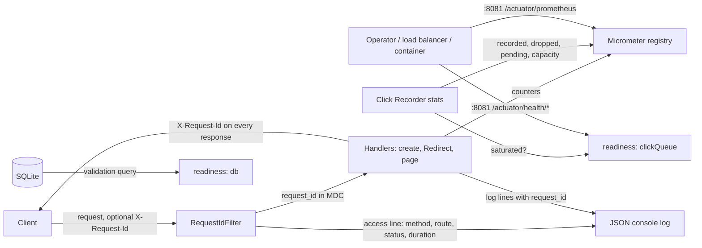

# Spec 0006: Operability basics: health checks, metrics, structured logs with request IDs, graceful shutdown and a first runbook

Glossary: `CONTEXT.md` · Decisions: ADR 0002, ADR 0012, ADR 0013, ADR 0014, **ADR 0015**, ADR 0021 · Builds on: spec 0003 (Clickstream) · Flows: `docs/architecture.md` · Roadmap: **R12** in `docs/roadmap.md` · Issue: [#96](https://github.com/SanjuktaDavuluri/simple-url-shortener/issues/96)

## Problem Statement

The shortener works, but nobody can run it in production with confidence. An operator can't answer the three questions ADR 0015 sets, *is it up and ready?*, *how is it behaving?* and *what happened to this request?*, without reading the code:

- **Up and ready.** The only sign of life is "the public port answers". `scripts/local.sh` and CI both wait for `GET /` to return a page. That says nothing about whether the database is reachable, or whether the Click Recorder's queue is full and dropping Clicks. R11 (the container) needs a real readiness check to use, and ADR 0015 forbids using "the port answers" for it.
- **Behaviour.** The Click Recorder has counted recorded, dropped and pending Clicks since spec 0003, but the counts stay inside the process. Spec 0003 promised R12 would publish them. Nothing counts Links created, Redirects, Rejections or Collisions either.
- **What happened.** Logs are Spring Boot's default plain text, and the app logs almost nothing per request. A user's report ("my Link gave an error at 10:42") can't be traced to log lines, and plain text can't be filtered by field.
- **Configuration.** Settings come from environment variables, but they are documented in the onboarding guide, in comments in `application.properties` and in `scripts/local.sh`. A bad value (for example a malformed `BASE_URL`) isn't caught at startup. It shows up later as wrong Short URLs.
- **Stopping.** A normal shutdown already saves queued Clicks (spec 0003), but in-flight requests, readiness during shutdown and the total time a stop can take are not specified or tested. `scripts/local.sh stop` gives up after 10 seconds and deletes the PID file even if the process is still running.
- **No runbook.** There is no written way to start, check, diagnose and stop the service.

## Solution

The service gets the operability basics ADR 0015 decided on, with nothing visible to API clients or visitors changing except one new response header.

- **Health checks on a separate management port** (`MANAGEMENT_PORT`, default `8081`), never on the public port (ADR 0015):
  - **Liveness** (`/actuator/health/liveness`): the process is alive. It never depends on the database, so a database problem can't make an orchestrator restart a healthy process.
  - **Readiness** (`/actuator/health/readiness`): the service can take traffic. It reports `UP` only when the database answers and the Click Recorder's queue isn't saturated, and `OUT_OF_SERVICE` from the moment a shutdown begins.
- **Metrics** in Prometheus format on the same management port (`/actuator/prometheus`): the standard HTTP, JVM and connection-pool metrics, plus the domain metrics ADR 0015 lists: Links created, Redirects, Rejections by Rule, Collisions, and Clicks recorded, dropped and pending.
- **Structured JSON logs** on the console, one JSON object per line. Every line logged while a request is handled carries that request's **Request ID**. The ID is taken from the caller's `X-Request-Id` header when it is safe to use, generated otherwise, and returned in the `X-Request-Id` response header on every response, errors included. Each request ends with one access line (method, route, status, duration). Logs never carry Long URLs, raw referrers, raw user agents, Manage Tokens or `Authorization` headers (ADR 0013, ADR 0014).
- **All configuration from the environment, documented in one place:** a configuration reference in the new runbook lists every environment variable, its default and its meaning. A test fails when a setting in `application.properties` is missing from it. Invalid values stop startup with a message naming the variable.
- **Graceful shutdown** on `SIGTERM`, in a fixed, tested order: readiness goes `OUT_OF_SERVICE`, the server stops taking new requests, in-flight requests finish (up to `SHUTDOWN_TIMEOUT`), queued Clicks are flushed (up to `CLICK_SHUTDOWN_TIMEOUT`, ADR 0012), then the database pool closes. The longest a stop can take is known and documented.
- **A first `docs/runbook.md`:** how to start, check, diagnose and stop the service, the configuration and metrics references, and what the logs contain and never contain.
- **The scripts and CI use readiness:** `scripts/local.sh start` and the CI browser-check job wait for readiness instead of `GET /`, and `scripts/local.sh stop` waits for the whole graceful shutdown. That leaves R11 a readiness check to use.

## User Stories

### Is it up and ready?

1. As an operator, I want a liveness endpoint that answers `200` with `UP` while the process is running, so that an orchestrator only restarts a process that is really stuck.
2. As an operator, I want liveness never to depend on the database or the Click queue, so that a database problem doesn't restart a process that would recover on its own.
3. As an operator, I want a readiness endpoint that answers `200` with `UP` only when the database answers a query and the Click queue isn't saturated, so that traffic goes only to an instance that can serve it.
4. As an operator, I want readiness to answer `503` (with `db` reported `DOWN`) when the database can't be reached, so that a broken instance is taken out of rotation.
5. As an operator, I want readiness to answer `503` while the Click queue is full, and `UP` again once it drains, so that an instance that is losing Clicks is visible (ADR 0015).
6. As an operator, I want readiness to report `OUT_OF_SERVICE` from the moment a shutdown begins, so that a load balancer stops sending new requests before the instance goes away.
7. As an operator, I want the health responses to name each component checked (`db`, `clickQueue`, and the readiness and liveness states) with its status, so that I can see *why* the instance isn't ready.
8. As an operator, I want readiness to be `UP` only after Flyway migrations have run, so that no traffic reaches an instance whose schema isn't ready. A failed migration stops startup.
9. As the maintainer of R11 (container) and of CI, I want a readiness URL I can poll with `curl -f`, so that "the app is up" means ready, not "the port answers" (ADR 0015).

### Keeping operational endpoints private

10. As an operator, I want health and metrics served only on the management port, so that operational internals are never exposed on the public address (ADR 0015).
11. As an operator, I want every Actuator path on the public port to answer `404`, as any unknown path does, so that the public surface is exactly the product.
12. As an operator, I want only the health and Prometheus endpoints exposed on the management port, so that nothing else (environment, configuration properties, heap dumps, shutdown) can be reached even from the operator network.
13. As a developer running a second instance next to the maintainer's, I want the management port to be configurable and `scripts/local.sh` to choose one that doesn't clash, so that a scratch run (`PORT=8765`) never collides with the maintainer's service on `8000`/`8081`.

### How is it behaving?

14. As an operator, I want HTTP request rate, errors and latency per route in Prometheus format, so that I can watch the Redirect hot path and Link creation separately.
15. As an operator, I want counts of Links created, Redirects (found and not found), Rejections by Rule and Collisions, so that I can see how the product is used and spot abuse or a Short Code space filling up.
16. As an operator, I want the Click Recorder's recorded, dropped and pending Clicks and its queue capacity published as metrics, so that Click loss is measured, not silent (ADR 0012, spec 0003).
17. As an operator, I want JVM and connection-pool metrics, so that I can tell memory pressure or a pool exhausted by SQLite's single writer (ADR 0021) from an application fault.
18. As an operator, I want every metric documented in the runbook with its name, type and meaning, so that I can use the metrics without reading code.

### What happened to this request?

19. As an operator, I want every log line to be a single JSON object with a timestamp, level, logger, message and any exception, so that logs can be filtered and searched by field.
20. As an operator, I want every line logged while a request is handled to carry the same Request ID, so that I can pull out everything that happened during one request.
21. As an API client or a person reporting a problem, I want every response, including `4xx` and `5xx` errors, to carry an `X-Request-Id` header, so that I can quote it and the operator can find my request.
22. As an API client that already has a correlation ID, I want the shortener to use my `X-Request-Id` when it is a safe value, so that my logs and the shortener's line up.
23. As an operator, I want an incoming `X-Request-Id` that is empty, too long or contains anything other than letters, digits, `.`, `_` and `-` to be replaced with a generated ID, and never logged as sent, so that a caller can't inject fake log lines or fields.
24. As an operator, I want one access line per request with the method, the matched route (for example `/{short_code}`), the status and the duration, so that I can see every request without logging what was submitted.
25. As a person following or creating a Link, I want the logs never to contain my Long URL, my full referrer, my user agent, my IP address, a Manage Token or an `Authorization` header, so that operating the service leaves no personal trail (ADR 0013, ADR 0014).
26. As an operator, I want an unexpected error logged once with its stack trace and the Request ID, while the client gets a `500` that reveals no internals, so that faults can be diagnosed without leaking details.
27. As a developer reading logs on my own machine, I want to switch the console to plain text with one environment variable, so that local logs stay readable when I need them to.

### Configuration

28. As an operator, I want every setting the service reads to be an environment variable with a documented default, so that one image runs anywhere without rebuilding.
29. As an operator, I want all of those settings listed in one place, the runbook's configuration reference, so that I don't have to piece them together from code and scripts.
30. As a maintainer, I want a test that fails when `application.properties` reads an environment variable the runbook doesn't document, so that the reference can't drift from the code.
31. As an operator, I want the service to refuse to start, with a message naming the variable, when `BASE_URL` isn't an absolute `http`/`https` URL without a query or fragment, or when a Click setting isn't positive, so that a misconfiguration is caught at deploy time instead of producing wrong Short URLs or a broken Click Recorder.
32. As an operator, I want one startup line listing the effective non-secret settings (ports, Base URL, database path, Click settings, log format), so that I can confirm what an instance is running with.

### Stopping

33. As a person following a Link while the service is being stopped, I want my in-flight request to complete normally, so that a deploy or restart doesn't fail requests already being served.
34. As an operator, I want new connections refused once the shutdown starts, and in-flight requests given up to `SHUTDOWN_TIMEOUT` to finish, so that a shutdown can't hang forever on a stuck request.
35. As an operator, I want queued Clicks flushed after the web server has stopped and before the database pool closes, so that Redirects served during the shutdown are still recorded (ADR 0012, spec 0003).
36. As an operator, I want the longest possible stop (`SHUTDOWN_TIMEOUT` + `CLICK_SHUTDOWN_TIMEOUT` plus a little) documented, so that I set my process manager's or container's stop grace period above it.
37. As an operator, I want the shutdown to log when it starts and when it has finished, with the number of Clicks flushed and dropped, so that I can confirm from the logs that a stop was clean.
38. As the maintainer, I want `scripts/local.sh stop` to wait for the graceful shutdown to finish and say so if the process is still running, so that it never reports "Stopped" while the app is still writing.

### Runbook

39. As an operator new to the service, I want a runbook that tells me how to start it (`java -jar`, `scripts/local.sh`), check it (liveness, readiness, metrics), diagnose it (finding a request by ID, the common symptoms and what to look at) and stop it, so that I can run it without the developers.
40. As an operator, I want the runbook to say which files make up the data (`links.db`, `links.db-wal`, `links.db-shm`, ADR 0021) and how to back them up safely, so that a backup isn't silently incomplete.
41. As an operator, I want the runbook to state the logging and exposure rules (what logs never contain, management port kept on the operator network, HTTPS in front of the service), so that the service is deployed the way it was designed.

### Evidence

42. As an external reviewer, I want a written impact analysis of the modules, APIs, configuration and data flows this change touches, so that I can see the brownfield change was understood before it was built.
43. As an external reviewer, I want each acceptance criterion traced to a test in the integration-testing plan's matrix, so that I can check every claim in this spec myself.

## Implementation Decisions

- **Dependencies:** `spring-boot-starter-actuator` and `micrometer-registry-prometheus`, both managed by the Spring Boot 4.1.1 parent. No other new dependency. Adding them is a dependency change and goes through the orchestrator's Approval Checkpoint.
- **Management server:**
  - `management.server.port=${MANAGEMENT_PORT:8081}`. Tests set it to `0` (random) and read it with `@LocalManagementPort`.
  - Exposure: `management.endpoints.web.exposure.include=health,prometheus`. Nothing else is exposed.
  - Health groups:
    - `liveness` = `livenessState`
    - `readiness` = `readinessState`, `db`, `clickQueue`
  - The groups show their components (`show-components=always`), not their details. Probes are enabled explicitly (`management.endpoint.health.probes.enabled=true`), not only when Spring detects Kubernetes.
- **Click queue health indicator (`clickQueue`):** reads the Click Recorder's `stats()`. It reports `OUT_OF_SERVICE` when pending Clicks reach the queue capacity (saturated), and `UP` otherwise. To support this, `QueuedClickRecorder` exposes its capacity. The indicator never blocks and never touches the database.
- **Database readiness:** Actuator's standard `db` indicator on the SQLite `DataSource` (a validation query through the Hikari pool). Flyway runs before the web server starts, and a failed migration stops startup, so a ready instance is always a migrated one.
- **Readiness during shutdown:** Spring Boot's availability state moves to `REFUSING_TRAFFIC` when the context starts closing. The readiness group reports it as `OUT_OF_SERVICE` for as long as the management server is still answering.
- **Metrics** (Micrometer names; Prometheus adds `_total` to counters):

  | Metric | Type | Tags | Source |
  |---|---|---|---|
  | `http.server.requests` | timer (standard) | method, uri (route pattern), status, outcome | Spring MVC |
  | JVM, process, `hikaricp.*` | standard | | Actuator auto-configuration |
  | `shortener.links.created` | counter | | `LinkService.create` after a save succeeds |
  | `shortener.redirects` | counter | `outcome` = `found` / `not_found` | `LinkController.followLink` (`GET` only, like Clicks) |
  | `shortener.rejections` | counter | `rule` = the rejecting Rule's name, e.g. `self_link`, `http_scheme` | `LinkService.create` |
  | `shortener.collisions` | counter | | `LinkService.create`, each Short Code drawn again |
  | `shortener.clicks.recorded` | function counter | | Click Recorder `stats().recorded` |
  | `shortener.clicks.dropped` | function counter | | Click Recorder `stats().dropped` |
  | `shortener.clicks.pending` | gauge | | Click Recorder `stats().pending` (queue depth) |
  | `shortener.clicks.queue.capacity` | gauge | | `CLICK_QUEUE_CAPACITY` |

  - The Click metrics read the existing `stats()`. The Click Recorder gains no dependency on Micrometer: a small binder in the configuration layer registers the functions.
  - `rule` tags come from a stable name per Rule. The Rule Set's rejected result names the Rule that rejected (a small additive change to the `rules` module, ADR 0004). Rejection Reasons and Long URLs are never tags.
  - No tag ever carries a Short Code, a Long URL or a host, so the number of time series stays bounded.
- **Request ID (`RequestIdFilter`, a servlet filter ordered first on the public port):**
  - It reads `X-Request-Id`. A value of 1–64 characters from `[A-Za-z0-9._-]` is used as is. Anything else, or no header, is replaced with a new random UUID. A rejected value is never logged.
  - It puts the ID in the logging MDC as `request_id` and sets the `X-Request-Id` response header **before** calling the rest of the chain, so it is present on every response: `2xx`, `3xx` (the Redirect), `4xx`, `5xx`, and the web page and static assets. It clears the MDC afterwards, so no ID leaks onto another request handled by the same thread.
  - It writes the **access line** at `INFO` when the request completes: `http_method`, `route` (the matched handler pattern, or `unmatched`), `status` and `duration_ms`. Never the raw path, the query string, headers or the body. The Redirect's route is `/{short_code}`, so the access line never carries a Long URL.
  - It applies only to the public port. Health probes on the management port aren't logged, so they don't flood the log.
- **Structured logging:**
  - Spring Boot's built-in structured console logging, in **ECS** format (`logging.structured.format.console=ecs`). MDC entries such as `request_id` become JSON fields.
  - `LOG_FORMAT` (`json`, the default, or `text`) switches the console between JSON and Spring's plain-text pattern. Any other value stops startup.
  - Log levels use Spring's standard environment binding (`LOGGING_LEVEL_ROOT`, `LOGGING_LEVEL_IO_GITHUB_SANJUKTADAVULURI_SHORTENER`), documented in the runbook rather than re-invented.
  - Background threads (the Click writer) log without a Request ID, because their lines don't belong to one request.
- **Errors:** an unexpected exception on the public port is logged once at `ERROR` with its stack trace and the Request ID, and the client gets a `500` with no stack trace or exception message (`server.error.include-stacktrace=never`, `include-message=never`), carrying `X-Request-Id`. Existing `4xx` responses (Rejections, malformed requests, unknown Short Codes) are unchanged and are not logged as errors.
- **What logs never contain** (enforced by tests, not only by convention): Long URLs, `Referer` and `User-Agent` values, IP addresses, request bodies, query strings, `Authorization` headers and Manage Tokens (ADR 0013, ADR 0014; spec 0005 adds the token in parallel).
- **Configuration:**
  - New environment variables: `MANAGEMENT_PORT` (`8081`), `SHUTDOWN_TIMEOUT` (`10s`, bound to `spring.lifecycle.timeout-per-shutdown-phase`), `LOG_FORMAT` (`json`).
  - Existing ones unchanged: `PORT`, `BASE_URL`, `DATABASE_PATH`, `CLICK_QUEUE_CAPACITY`, `CLICK_BATCH_SIZE`, `CLICK_FLUSH_INTERVAL`, `CLICK_SHUTDOWN_TIMEOUT`.
  - The SQLite pool size, WAL mode and busy timeout stay fixed in `application.properties` and are **not** made configurable (ADR 0021: don't shrink the pool or turn WAL off without a new ADR). The runbook lists them as fixed settings with the ADR link.
  - **Validation at startup:** `ShortenerProperties` checks its values when it is bound. If a check fails, startup stops with a message naming the environment variable and the bad value. The service fails when:
    - `BASE_URL` isn't an absolute `http`/`https` URL with a host and no query or fragment. A trailing `/` is removed, so Short URLs never contain `//`.
    - any `CLICK_*` setting isn't positive, or `CLICK_BATCH_SIZE` is larger than `CLICK_QUEUE_CAPACITY`.
  - **Startup line:** one `INFO` line once the app is ready, listing the port, management port, Base URL, database path, Click settings, shutdown timeouts and log format. Nothing secret is configured today. Any future secret setting must be left out of this line.
- **Graceful shutdown:**
  - `server.shutdown=graceful` is set explicitly, even though it is Spring Boot's default, so a change of default can't silently remove it. `spring.lifecycle.timeout-per-shutdown-phase=${SHUTDOWN_TIMEOUT:10s}`.
  - Order on `SIGTERM` or context close:
    1. Readiness goes `OUT_OF_SERVICE`.
    2. The public server stops accepting connections, and in-flight requests finish (up to `SHUTDOWN_TIMEOUT`).
    3. The Click Recorder flushes (up to `CLICK_SHUTDOWN_TIMEOUT`; its existing `SmartLifecycle` phase already stops after the web server).
    4. The pool closes.
  - With the defaults, a stop takes at most about 20 seconds (10 s + 10 s), plus a few seconds to close the pool.
  - The app logs `Shutdown started` and `Shutdown complete` lines. The second line carries the Clicks flushed and dropped during the stop, taken from the Click Recorder's existing `stop()` counts.
- **`scripts/local.sh`:**
  - `MANAGEMENT_PORT` defaults to `PORT + 81`, so the maintainer's `8000` keeps `8081`, and a scratch `PORT=8765` gets `8846`. Like `PORT`, it is checked to be free before starting.
  - `start` waits for `/actuator/health/readiness` to answer `200`, instead of `GET /`.
  - `status` prints the readiness status.
  - `stop` waits up to `SHUTDOWN_TIMEOUT` + `CLICK_SHUTDOWN_TIMEOUT` + 5 s. It removes the PID file only once the process has exited, and otherwise says that it is still running.
  - `LOG_FORMAT` is passed through.
- **CI (`ci.yml`, the browser-checks job):** "Start the app" polls `http://localhost:8081/actuator/health/readiness` instead of `$BASE_URL/`. **The job names don't change**, so the required checks on `main` are unaffected.
- **API contract:** unchanged, apart from the new `X-Request-Id` response header on every public response. Status codes, bodies, routes and the Redirect's `Location` and `Cache-Control: no-store` are exactly as before.
- **No new ADR expected.** ADR 0015 already decides the tooling, the separate port, the health groups and the log rules. The decisions above apply it.

## Impact Analysis

This is a brownfield change across the service's configuration, its request handling (every public request now passes a new filter), its shutdown, and the scripts and CI that start it.

### Modules

| Module | Change | Risk and how it's contained |
|---|---|---|
| `pom.xml` | **Changed:** Actuator and the Prometheus registry | A dependency change (Approval Checkpoint). Both are managed by the Boot parent, so the versions stay aligned. Actuator auto-configuration is limited by the explicit exposure list |
| `application.properties` | **Changed:** management port and exposure, health groups, probes, structured logging, graceful shutdown, error detail settings | Affects every startup. Covered by the whole existing suite plus new configuration tests. Pool, WAL and busy-timeout lines are untouched (ADR 0021) |
| `ShortenerProperties` | **Changed:** validation, and `BASE_URL` trailing `/` normalised | Could reject a configuration that starts today. Only values that already produce broken Short URLs or a broken Click Recorder are rejected; tests cover each case and the defaults |
| `RequestIdFilter` | **New:** Request ID, MDC, response header, access line | Runs on every public request, including the Redirect hot path. It does constant work (header check, one UUID, one log line); R13 measures its cost. Existing HTTP tests must pass unchanged apart from the new header |
| `LinkService.create`, `LinkController.followLink` | **Changed:** increment counters | Counter increments only. No change to control flow, responses or the Click handover. Existing tests are the regression check |
| `rules` (`RuleSet` / `RuleResult.Rejected`, each Rule) | **Changed:** a rejected result names its Rule | Additive. Rejection Reasons and the Rule tests are unchanged (ADR 0004) |
| `QueuedClickRecorder` | **Changed:** exposes its capacity, and reports the Clicks flushed and dropped at stop | Its queue, writer and shutdown behaviour are unchanged. Its unit tests stay green |
| Click metrics binder, `clickQueue` health indicator, startup and shutdown log lines | **New** | Read-only views of `stats()`. They never block or touch the database |
| `LinkStore`, `JdbcLinkStore`, `ClickStore`, `JdbcClickStore`, `ClickClassifier`, `PageController`, templates, static assets, migrations | **Unchanged** | No schema change, so this spec takes no Flyway version number |
| Test harness (`IntegrationTest`, `TestApps`) | **Changed:** random management port; helpers to read health and metrics; captured log output parsed as JSON | Plan 0001 principles 1 and 3 hold. Principle 1 gains two declared seams (see Testing Decisions) |
| `scripts/local.sh` | **Changed:** management port, readiness wait, status, and a `stop` that waits | The maintainer's running service on `8000`/`8081` keeps the same ports. A scratch run gets its own pair |
| `.github/workflows/ci.yml` | **Changed:** the browser-checks job waits on readiness | Job names unchanged, so required checks are unaffected |

### APIs

- **Public HTTP API and web page:** a new `X-Request-Id` response header on every response. An incoming `X-Request-Id` is now read. Nothing else changes: no status code, body, route or existing header.
- **New operational surface (management port only):** `GET /actuator/health/liveness`, `GET /actuator/health/readiness`, `GET /actuator/health`, `GET /actuator/prometheus`. None of them is reachable on the public port.
- **Internal interfaces:** `RuleResult.Rejected` gains the Rule's name. `QueuedClickRecorder` exposes its capacity. `ClickRecorder`, `ClickStore` and `LinkStore` are unchanged.
- **Configuration surface:** three new optional variables (`MANAGEMENT_PORT`, `SHUTDOWN_TIMEOUT`, `LOG_FORMAT`). The existing ones are now validated, and a value that is invalid today stops startup instead of misbehaving.
- **Log format:** the console changes from plain text to JSON by default. Anything reading `.local/app.log` or CI's `app.log` by eye still can, and `LOG_FORMAT=text` restores the old format.

### Data flows

- **New data read from requests:** the `X-Request-Id` header (validated, at most 64 safe characters). No other header is newly read.
- **New data written:** log lines only. The access line holds the method, route pattern, status, duration and Request ID. Nothing is stored in the database.
- **Log volume:** one access line per public request, about 300 bytes. At R13's target of 200 Redirects/s that is about 5 GB/day. The runbook says how to raise the access logger's level to `WARN` to turn it off, and that log rotation is the platform's job (container logs) or `local.sh`'s file.
- **Shutdown:** a stop now has a documented upper bound of `SHUTDOWN_TIMEOUT` + `CLICK_SHUTDOWN_TIMEOUT` + pool close, about 20 s with the defaults.
- **Exposure:** a second listening port. It must be kept off the public network: in R11 it is published only to the host or the Compose network, never through the public ingress.

### Downstream roadmap items

- **R11 (container):** the Docker `HEALTHCHECK` and Compose `healthcheck` use `curl -f http://localhost:8081/actuator/health/readiness`. Compose's `stop_grace_period` must exceed the shutdown bound (30 s recommended), because Docker's default 10 s would cut the Click flush short. Port `8081` is not published publicly. The image sends `SIGTERM` to the Java process (exec form `ENTRYPOINT`).
- **R2 (stats, spec 0005, in parallel):** its Manage Token and `Authorization` header must stay out of logs. The access line never logs headers or bodies, and this spec's log privacy test sends an `Authorization` header to prove it. R2's own domain metrics, if any, are R2's to add (ADR 0015: every new feature adds its own). Whichever of the two merges second adds its rows to the other's plan phase without renumbering.
- **R3 (spec 0004):** no overlap. This spec adds no migration.
- **R13 (load tests):** reads the Prometheus metrics (Redirect latency per route, Click drops and queue depth) and measures the Request ID filter's cost on the Redirect path.
- **R14 (failure tests):** asserts readiness `OUT_OF_SERVICE` when the database is unavailable, Clicks dropped and counted under a stand-in Click Store, and a clean graceful shutdown under load. This spec gives it the endpoints and metrics to observe.
- **R21 (OpenAPI):** documents the `X-Request-Id` request and response header.

### Documents to update with the tickets

- **New:** `docs/runbook.md`.
- **Configuration table:** the table in `docs/onboarding.md` moves into the runbook's configuration reference, and onboarding links to it.
- **Also updated:** `docs/architecture.md` (the request path with the filter, the management port, the shutdown sequence), `CONTEXT.md` (Request ID, Readiness, Liveness), `docs/plans/0001-integration-testing.md` (a new operability phase, the two new seams, matrix rows), `README.md` (the runbook in the reviewer's map), the spec index, and the R12 row of `docs/roadmap.md`.

## Testing Decisions

- **What makes a good test here:** as in specs 0001 and 0003, tests exercise external behaviour through declared seams, use glossary terms in their names, and take expected values from this spec, never recomputed from the code.
- **Seam 1: the public HTTP surface (existing).** All existing HTTP tests stay unchanged and must pass. New tests cover these:
  - `X-Request-Id` is present on a `201`, a `302` Redirect, a `400` Rejection, a `404`, the web page, a static asset and a forced `500`.
  - A safe incoming ID is echoed back.
  - Empty, 65-character and unsafe incoming IDs (with a newline, `"`, `{`) are replaced by a generated one, and two requests without one get different IDs.
  - Every Actuator path (`/actuator`, `/actuator/health`, `/actuator/health/readiness`, `/actuator/prometheus`) answers `404` on the public port.
  - A forced `500` (a stand-in handler on its own `TestApps` instance) reveals no exception message or stack trace in its body.
- **Seam 2: the management HTTP surface (new declared seam).** Tests use a random management port and plain HTTP, as for the public port:
  - Liveness `200` `UP`. Readiness `200` `UP`, with components `db`, `clickQueue` and `readinessState`.
  - Readiness answers `503` when the database can't be reached. A `TestApps` instance points at a database file that is removed or made unreadable after startup (a stand-in `DataSource` if the file approach proves flaky). Liveness stays `200` meanwhile.
  - Readiness answers `503` while the Click queue is saturated, using a blocked stand-in Click Store and a small capacity (the seam spec 0003 already uses, on its own `TestApps` instance), and `200` again after it drains.
  - Readiness reports `OUT_OF_SERVICE` once the context starts closing.
  - Only `health` and `prometheus` are exposed: for example `/actuator/env`, `/actuator/configprops`, `/actuator/heapdump` and `/actuator/shutdown` answer `404`.
  - Prometheus output contains every metric in the table. After a scripted sequence (one Link created, one Rejection by the Self-link Rule, one scripted Collision, two Redirects, one unknown Short Code), the counters change by exactly those amounts. The Click metrics match `stats()` after a flush.
- **Seam 3: captured log output (new declared seam).** Spring's `OutputCaptureExtension` captures the console. Tests parse each line as JSON and assert on fields, never on the exact message text:
  - Every captured line parses as one JSON object.
  - Every line written while a request is handled carries a `request_id` equal to that response's `X-Request-Id`. This is shown with a request that logs inside the handler (the Click handover failure warning, with a throwing stand-in Click Recorder on its own `TestApps` instance) and with the access line.
  - The access line has the method, the route `/{short_code}`, the status and a duration, and no raw path or query string.
  - **Privacy:** create a Link with a distinctive Long URL, Redirect it with a distinctive `Referer`, `User-Agent` and `Authorization` header and a query string, then trigger a Rejection and a `500`. None of those distinctive values appears anywhere in the captured output (ADR 0013, ADR 0014).
  - An unsafe incoming `X-Request-Id` doesn't appear in the output.
  - `LOG_FORMAT=text` gives non-JSON lines. An unknown `LOG_FORMAT` stops startup.
- **Configuration (integration, through `TestApps` startup):**
  - Each invalid value stops startup with a message naming its environment variable: a relative `BASE_URL`, an `ftp:` one, one with a query, `CLICK_BATCH_SIZE=0`, and a batch size larger than the capacity.
  - A `BASE_URL` with a trailing `/` gives Short URLs without `//`.
  - The startup line lists the effective settings.
- **Configuration reference drift (unit):** a test reads `application.properties`, collects every `${NAME:` placeholder, and asserts each `NAME` appears in the runbook's configuration table. A new setting without documentation fails the build.
- **Graceful shutdown (integration, `TestApps`):**
  - Start an instance with a stand-in slow handler. Start a request, then close the context while it is in flight: the request completes with its normal response, and a new connection after the close begins is refused.
  - With a `SHUTDOWN_TIMEOUT` shorter than the handler, the close finishes within the bound instead of waiting for the handler.
  - A Redirect served during the shutdown still has its Click saved (this extends spec 0003's `ClickShutdownIT`).
  - The `Shutdown complete` line reports the Clicks flushed.
- **Scripts:** `scripts/local.sh` is exercised by hand in the PR on a scratch port and data directory (`PORT=8765 DATA_DIR=<scratch>`, never the maintainer's service): start waits for readiness, status shows it, and stop waits and reports. CI's browser-check job is the automated proof that the readiness wait works.
- **Not tested here:** behaviour under load and the filter's latency cost (R13), database outages under load, full disks and container kills (R14), the container health check itself (R11).
- **Prior art:**
  - `TestApps` (extra instances with their own settings and database file)
  - `ClickShutdownIT` (closing a context and restarting on the same file)
  - `RedirectNeverWaitsForClicksIT` (stand-in Click Recorder and Click Store on their own instances)
  - `ConfigurationIT` (settings through startup)
  - spec 0005's planned use of `OutputCaptureExtension` for token privacy
- **Plan and matrix:**
  - Plan 0001 gains an **operability phase** with these criteria and its exit evidence. It takes the next free phase number when it lands, after whichever of R2 or R3 merges first.
  - Principle 1 is amended to declare the management port and captured log output as seams. Principle 2 records the stand-ins used here (slow handler, failing handler, unreachable database).
  - Every ticket's PR adds its rows to the traceability matrix.
- **Process:** every ticket is built test-first (red → green → refactor) with the `tdd` skill. `./mvnw verify` stays the single entry point.

## Out of Scope

- The container image, Compose file and container health check (R11). This spec gives them the readiness URL and the shutdown bound.
- A Prometheus server, dashboards and alerting. ADR 0015 leaves them outside this project. The runbook lists the queries worth alerting on.
- Distributed tracing and OpenTelemetry export (ADR 0015 option B).
- Load, latency and SLO measurement (R13), and failure and resilience testing (R14).
- Rate limiting (R19) and security headers (R20).
- Authentication on the management port. It is protected by network placement (ADR 0015). Adding authentication would need a new decision.
- Making the SQLite pool size, WAL mode or busy timeout configurable (ADR 0021).
- Log shipping, retention and rotation beyond the console. These are the platform's job.
- The OpenAPI description of the new header (R21).
- Domain metrics for R2's Stats (spec 0005, if it wants them).

## Further Notes

- **Decided while writing this spec, all easy to change:**
  - the header name `X-Request-Id` and the 64-character safe-ID rule
  - ECS as the JSON format
  - `LOG_FORMAT` with `json`/`text`
  - an access line per request at `INFO`
  - `SHUTDOWN_TIMEOUT` default `10s`
  - "saturated" meaning the queue is completely full
  - `local.sh`'s `PORT + 81` management port default
  - health groups showing components but not details
- **Readiness and the Click queue:** ADR 0015 puts "Click queue not saturated" in readiness. With a single instance, a traffic spike that fills the queue makes readiness flap. A load balancer would then take the only instance out even though Redirects still work. This spec follows the ADR with the strictest threshold (completely full). R13 should look for flapping under load. If it appears, a threshold or a short hold time is a configuration change, not a new ADR.
- **Metrics scope:** the Issue lists health, logs, configuration, shutdown and the runbook. The domain metrics are included because ADR 0015 decides them, the Issue cites ADR 0015 as already decided (Micrometer), and spec 0003 commits R12 to publishing the Click counts. Without them, Click loss would stay unmeasured.
- **Glossary candidates** for `CONTEXT.md`:
  - **Request ID:** the identifier of one request to the shortener, returned in `X-Request-Id` and carried on every log line written while handling it. _Avoid:_ trace ID, correlation ID, transaction ID.
  - **Liveness:** the process is running and should not be restarted.
  - **Readiness:** the instance can serve traffic now: database reachable, Click queue not saturated, not shutting down. _Avoid:_ healthy (on its own), up.
- **Possible ticket slices** for decomposition (the decompose Stage decides):
  1. Actuator on the management port, with liveness, readiness (`db`, `clickQueue`) and exposure limits.
  2. Request ID filter, structured JSON logs, the access line and the log privacy tests.
  3. Domain and Click metrics.
  4. Configuration validation, the startup line and graceful shutdown.
  5. `local.sh` and CI on readiness.
  6. The runbook with its configuration reference and drift test, plus the documentation updates.
- **Status lifecycle:** `draft → accepted → in-progress → implemented`. Set to `in-progress` when the first ticket starts and to `implemented` when the last ticket's work is merged. Add the spec to the index in `docs/specs/README.md` when it is accepted.
