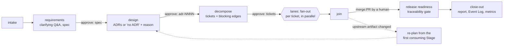

# Engineering summary

One document that explains the system, how it is delivered, and the evidence. Each section links to its source document. Numbers come from committed files (`delivery/metrics.md`, `delivery/runs/R-0001/`), not from memory.

**State on 2026-10-08:**
- Release 1 (greenfield) is tagged [`v1.0.0`](releases/v1.0.0.md).
- In Release 2, the delivery orchestrator (R18) and the Clickstream (R10) are merged.
- R2, R12, R11 and R21 come next ([roadmap](roadmap.md)).

## 1. Plan and rationale

The work is split into three Releases. Each Release is a lifecycle phase, and each one builds on the evidence of the one before:

| Release | Phase | What it delivers | Why in this order |
|---|---|---|---|
| 1 | Greenfield | A JSON API (create, Redirect), URL Rules, Collision handling and a web page | A small, well-tested core comes first. Every later change is a brownfield change to it |
| 2 | Brownfield, orchestrated | The delivery orchestrator (R18) first. Then every feature through it: Clickstream (R10) → analytics (R2), with operability (R12 → R11 → R21) in parallel | Building the orchestrator first means the rest of the Release is delivered *by* it, which makes it the strongest test of the orchestrator |
| 3 | Reliability | Security hardening, load tests (R13), failure tests (R14), a requirement-clarification case study (R23), the scaling ADR (R25) | You measure before you test failure. Write-ups come last, from the real history |

**Principles:**
- **Agents execute and humans decide.** Agents can't merge, push to `main`, edit policy or skip a gate.
- **Every decision is written down:** specs for the *what*, ADRs for the *why* (21 so far), and Issues for the *work*.
- **Every change** is a feature branch, then a PR with `Closes #n` and green CI, then a human merge.

## 2. Architecture overview

### Components

The repository holds two separate planes ([README diagram](../README.md#two-planes-the-product-and-how-it-is-delivered)):

| Plane | Component | Technology | Responsibility |
|---|---|---|---|
| Product (runtime) | Shortener service | Java 25, Spring Boot 4.1.1, SQLite with Flyway | The JSON API, the Redirect and the web page |
| | URL Rules | A pure module ([ADR 0004](adr/0004-url-rules-as-separate-module.md)) | Validates and normalises Long URLs, and blocks private addresses without DNS ([ADR 0018](adr/0018-private-address-rule-without-dns.md)) |
| | Link Store / Click Store | The only modules that touch their tables | Persistence behind interfaces ([ADR 0002](adr/0002-sqlite-for-v1-storage.md), [ADR 0021](adr/0021-sqlite-wal-busy-timeout-and-small-connection-pool.md)) |
| | Click Recorder | A bounded queue with a batch writer | Keeps the Redirect fast. Loss is counted, never hidden ([ADR 0012](adr/0012-clicks-recorded-asynchronously.md)) |
| Delivery (dev time) | Orchestrator | Python, LangGraph state graph, Claude Agent SDK steps | Turns an Issue into a spec, ADRs, tickets and merge-ready PRs ([ADR 0007](adr/0007-delivery-orchestrator.md)) |
| | Policy engine | `orchestrator/policies.yaml`, protected by CODEOWNERS | Checks every agent action before it runs, and every step's diff after it ([ADR 0010](adr/0010-orchestrator-policy-guardrails.md)) |
| | Event Log | An append-only, hash-chained `events.jsonl` per Run | The audit trail, the report and the metrics ([ADR 0009](adr/0009-orchestrator-state-audit-and-metrics.md)) |

The orchestrator **never deploys and never connects to a running service**. Its test gates start a temporary instance, with its own port and data directory. The only way a change reaches `main` is a PR that a human merges.

Request flows (create, Redirect, Click) are drawn in [`architecture.md`](architecture.md).

### Orchestration model and control flow

A Run is an explicit dependency graph of Stages ([ADR 0008](adr/0008-orchestrator-stage-graph-and-governance.md)). Each Stage has an **Entry Gate** (its inputs exist and are approved) and an **Exit Gate** (machine checks on its output):



| Concern | How it is handled | Source |
|---|---|---|
| Sequential and parallel paths | Stages run in sequence. Tickets fan out as **Lanes** along their blocking edges, at most `max_parallel_lanes` at a time, and synchronise at a join | [ADR 0020](adr/0020-parallel-lanes-fan-out-in-the-graph-waits-at-the-join.md) |
| Each Lane | Has its own git worktree: implement → verify gate (`mvnw verify`, plus browser checks on a temporary instance) → document → PR → required checks | [orchestrator README](../orchestrator/README.md#the-stages-so-far) |
| Human approval checkpoints | `spec`, one per ADR, `tickets`, `dependency:<lane>` (any manifest change), `amendment-N`, and every merge. Each approval is **bound to the content hash** it approved, so a later edit voids it | [ADR 0008](adr/0008-orchestrator-stage-graph-and-governance.md) |
| Bounded retries | A failed gate's output goes back to the agent up to `max_retries` times. Then the Stage pauses | [Failure handling](../orchestrator/README.md#failure-handling) |
| Fallback | A gate that *can't run on this machine* (a missing runtime) pauses at once, instead of wasting agent retries. A usage limit pauses the step with its spend recorded | same |
| Rollback | `reject <run> lane:<key>` closes the PR and deletes the branch and worktree. The ticket goes back to Todo, dependants are skipped, and the Run ends *partially delivered* | same |
| Safe-stop | `orchestrate stop`, a `stop` label, or a cost cap: the current step finishes, and nothing is repeated on `resume` | same |
| Cross-stage context and lineage | Every Stage records the hashes of its inputs and of the approvals it relied on | [ADR 0011](adr/0011-orchestrator-replanning-and-lineage.md) |
| Dynamic re-planning | When an upstream artifact changes (Issue, spec, ADR, tickets), the Run restarts from the first Stage that consumes it. Approvals are withdrawn. Merged Lanes are never rewritten: they get follow-up tickets | same |
| Policy guardrails | Before each action: no push to `main`, no force-push, no `gh pr merge`, no `sudo`, no piped downloads, no protected-path writes, no credential-like content, a network allow-list. Wrappers such as `bash -c` and `env` are caught too. After each step: the diff is checked again | [Policy guardrails](../orchestrator/README.md#policy-guardrails) |
| Audit-grade traceability | A hash-chained Event Log (`orchestrate verify`). Approvals record who approved, how, and the hash. Release readiness checks that every commit names its ticket and every PR says `Closes #n` | [ADR 0009](adr/0009-orchestrator-state-audit-and-metrics.md) |
| Reliability metrics | `orchestrate metrics` reports success rate, retry and rollback frequency, MTTR, end-to-end latency (total and excluding human wait) and cost per Run | [`delivery/metrics.md`](../delivery/metrics.md) |

### Key decisions

All 21 decisions are in [`docs/adr/`](adr/). These are the ones that shape the system most:

| Decision | Choice | Main trade-off accepted |
|---|---|---|
| Storage ([0002](adr/0002-sqlite-for-v1-storage.md), [0021](adr/0021-sqlite-wal-busy-timeout-and-small-connection-pool.md)) | SQLite in WAL mode with a small pool | Simple to run, but one writer at a time. Scaling follows evidence-based triggers ([0019](adr/0019-staged-evidence-triggered-scaling-path.md)) |
| Redirect status ([0005](adr/0005-302-redirects-keep-us-in-the-path.md)) | `302`, not `301` | Every Click reaches us, at the cost of no browser caching |
| Click recording ([0012](adr/0012-clicks-recorded-asynchronously.md)) | Asynchronous, bounded queue | The Redirect never waits. Clicks may be lost under overload, but every loss is counted |
| Privacy ([0013](adr/0013-clicks-store-minimal-non-personal-data.md)) | Store the referrer host and the user-agent category only | Less analytics detail, but no personal data stored |
| Orchestrator shape ([0007](adr/0007-delivery-orchestrator.md), [0008](adr/0008-orchestrator-stage-graph-and-governance.md)) | A stateful graph with gates and hash-bound approvals | More machinery than a script chain, but it can resume, re-plan and be audited |

## 3. Scenarios

### 3.1 Greenfield: v1 core (Release 1)

- **Decomposition:** a one-line idea became [spec 0001](specs/0001-v1-core.md), with numbered user stories and testing decisions. That became ADRs 0001–0006 and vertical-slice Issues with blocking links ([v1.0.0 notes](releases/v1.0.0.md)).
- **Orchestration:** this was before the orchestrator existed. The same lifecycle was run by hand, with Claude Code under the [`CLAUDE.md`](../CLAUDE.md) charter: tests first, one PR per Issue, and a human merge for each. That manual run became the template for the orchestrator's Stages.
- **Validation:** unit and integration tests, traced story by story in the [integration-testing plan](plans/0001-integration-testing.md), browser checks in [`e2e/`](../e2e/README.md), CI on every PR, and Lighthouse 100 in every category.

### 3.2 Brownfield: Clickstream (R10), delivered by orchestrator Run R-0001

This change adds a write to the Redirect path, the product's hot path, so it carries the highest risk.

- **Codebase reasoning:** [spec 0003](specs/0003-clickstream.md#impact-analysis) has a written impact analysis covering the affected modules, the unchanged API contract, the new data flow and the downstream roadmap items. It found a real conflict: the single-connection SQLite pool would make Redirects wait behind Click batch writes. That finding led to [ADR 0021](adr/0021-sqlite-wal-busy-timeout-and-small-connection-pool.md), which the design Stage proposed and a human approved.
- **Decomposition:** 7 tickets with blocking edges ([`tickets.json`](../delivery/runs/R-0001/tickets.json)):

  ```text
  T1 WAL + pool ──┐
                  ├─► T3 tracer bullet ─┬─► T4 bounded loss ─► T5 shutdown flush ─┐
  T2 Classifier ──┘                     └─► T6 Redirect never waits ──────────────┴─► T7 docs
  ```

- **Orchestration** ([report](../delivery/runs/R-0001/report.md), 186 events):
  - T1 and T2 ran **in parallel**. Then T4 and T6. Every Lane waited at the join for its blockers to merge.
  - A human **rejected** the first ticket breakdown, because T7 would have edited `docs/specs/`. The decompose Stage revised it, and the new version needed a fresh approval.
  - The policy engine **blocked 3 agent actions**: network calls to hosts not on the allow-list.
  - The orchestrator **paused instead of retrying blindly** in three situations: a missing Java runtime, merge conflicts between sibling Lanes, and a usage limit. Each time a human fixed the cause, then ran `resume`.
  - Release readiness **failed** on commits that didn't name their ticket. They were fixed before close-out.
- **Validation:** every Lane passed `mvnw verify` in its own worktree, then the required CI checks. A test proves the Redirect doesn't wait under write contention (T6). The [spec 0003 coverage table](plans/0001-integration-testing.md#spec-0003-coverage) traces each story to its tests.
- **Results** ([`delivery/metrics.md`](../delivery/metrics.md)): delivered, with 0 rollbacks, 4 retries across 22 Stage executions, MTTR 18m 10s, 1h 43m of latency excluding human wait (9h 00m in total), and $18.46.

### 3.3 Ambiguous requirement: "add analytics"

The roadmap first said only "analytics". That one word hid several open questions. Each was settled one at a time, each with a recommended answer, before any code was written:

| Open question | Risk if guessed | Resolution |
|---|---|---|
| Must a Redirect wait for its Click to be saved? | Slow or failed Redirects for everyone | No. Asynchronous, with bounded, counted loss ([ADR 0012](adr/0012-clicks-recorded-asynchronously.md)) |
| What do we store about a visitor? | Holding personal data (IP addresses, full user agents) | Only the referrer host, an agent category and a device class. The raw header values are never stored or logged ([ADR 0013](adr/0013-clicks-store-minimal-non-personal-data.md)) |
| Who may see a Link's stats? | Leaking traffic data to anyone who knows the Short Code | Only the Link's creator, through a manage token ([ADR 0014](adr/0014-creator-only-stats-via-manage-token.md)) |
| Is it one feature or two? | One large, risky change to the hot path | Two: capture first (R10, [spec 0003](specs/0003-clickstream.md)), then reading (R2) |
| Does `301` caching hide Clicks? | Counts that are silently too low | `302` stays ([ADR 0005](adr/0005-302-redirects-keep-us-in-the-path.md)) |

Because these answers were already recorded, R-0001's requirements Stage found nothing left to ask. It wrote the spec straight away, in 7 minutes, and a human approved it.

The orchestrator also handles an ambiguous Issue directly: its requirements Stage posts clarifying questions on the Issue, one at a time with a recommended answer, and waits for replies (spec 0002, story 8).

The full worked case study, from a deliberately one-line "expiring links" request (R3) to an orchestrated build, is planned as **R23**.

## 4. Testing approach

| Layer | What it covers | Where |
|---|---|---|
| Unit | Pure modules: URL Rules, the Click Classifier, the policy engine, gates, the graph | `src/test/`, `orchestrator/tests/` |
| Integration | The real Spring context and SQLite: API contracts, the Redirect, Click recording, loss, shutdown flush, WAL contention | `src/test/`, [plan 0001](plans/0001-integration-testing.md) |
| Browser | The web page with and without JavaScript, the CSP and accessibility | [`e2e/`](../e2e/README.md) |
| Orchestrator | The graph with fake agents and fake GitHub: gates, retries, rollback, safe-stop, re-plan, policy bypass attempts, Event Log integrity | `orchestrator/tests/` |
| Gate in every Lane | `mvnw verify` and browser checks against a temporary instance, then the required CI checks on the PR | [orchestrator README](../orchestrator/README.md#the-stages-so-far) |

**Traceability:** spec story → test, in [plan 0001's matrix](plans/0001-integration-testing.md#5-traceability-matrix). Key guards were mutation-checked: the guard was broken on purpose, and the test was confirmed to fail.

## 5. Risks, trade-offs and guardrails

| Risk | Guardrail |
|---|---|
| An agent makes a destructive or unapproved change | Pre-action policy checks, post-step diff checks, protected paths, no merge rights, human merges |
| Approved content is changed after approval | Approvals are bound to content hashes. Re-planning withdraws stale approvals |
| Runaway cost or loops | Per-Run and per-step cost caps, bounded retries, safe-stop |
| The audit trail is edited | A hash-chained Event Log, checked by `orchestrate verify` |
| Clicks slow down the Redirect | An asynchronous bounded queue, WAL, and a contention test |
| Clicks are lost | A bounded queue, with dropped Clicks counted and logged (counts only), and a flush on shutdown |
| Personal data | Minimal Click data, and no raw headers logged |
| Abuse of the shortener | Rate limiting per client IP ([0016](adr/0016-in-app-rate-limiting-per-client-ip.md)), a strict CSP ([0017](adr/0017-strict-content-security-policy-and-security-headers.md)), private addresses blocked |

## 6. Assumptions

- The service runs as one instance on one SQLite file. The scaling path, and the triggers for taking it, are in [ADR 0019](adr/0019-staged-evidence-triggered-scaling-path.md).
- GitHub (Issues, PRs, required checks, the project board) is the system of record for work and approvals.
- One maintainer approves and merges.
- The orchestrator runs on a developer machine with Java, Node and `uv` installed.

## 7. Limitations and known issues

**Orchestrator issues found during R-0001,** to be fixed in Release 2:
- A Run doesn't pick up changed settings, except `--cost-cap-run`. R-0001 needed `JAVA_HOME` exported by hand.
- `status` shows merged PRs as still waiting for checks.
- An approval request is logged before the conflict check that pauses the Lane.
- Sibling Lanes conflict on the same README and plan rows. These are resolved by hand, then `resume`.
- Agent shell steps inherit the user's interactive shell configuration, which can make simple commands hang.
- Close-out logs no `pr_opened` event, and its PR has no `Closes #<issue>`.

**Product:**
- Click data isn't readable yet: R2 adds the stats API.
- There are no health endpoints, structured logs or container yet: R12, R11 and R21.
- There are no load or failure-test results yet: R13 and R14 in Release 3.

**Evidence:**
- One live orchestrated Run (R-0001) so far, so the metrics describe a single Run. R-0001 had no rollback and no re-plan. Those paths are shown by the scripted demo Run (`scripts/orchestrator-demo.sh`, saved in [`delivery/demo/`](../delivery/demo/timeline.txt)), which runs the real graph, gates and Event Log with a scripted agent.
- End-to-end latency is mostly human wait (9h total against 1h 43m excluding it). That is expected, because every checkpoint waits for a person.

## 8. Setup

See [Quick start](../README.md#quick-start) and the [onboarding guide](onboarding.md) for the service. See [`orchestrator/README.md`](../orchestrator/README.md#setup) for the orchestrator.

In short:

```bash
./mvnw verify && scripts/local.sh                   # build, test and run the service on :8000
cd orchestrator && uv sync && uv run pytest         # orchestrator tests
uv run orchestrate status                           # list Runs
uv run orchestrate verify --all && uv run orchestrate metrics
../scripts/orchestrator-demo.sh                     # a complete scripted Run: no API key, no network
```
