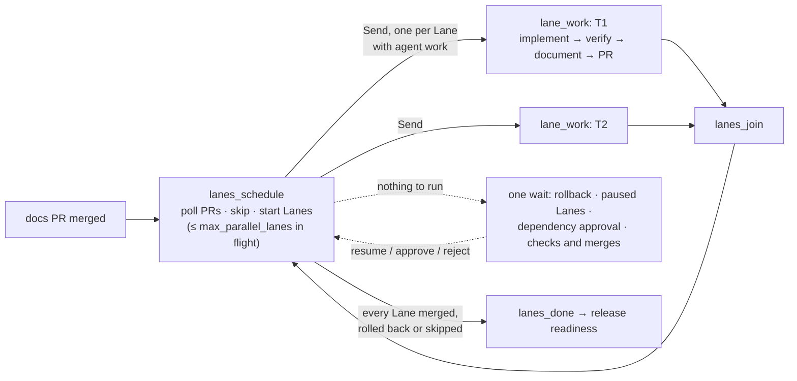

# Delivery orchestrator

The **delivery plane** of this repository: a development-time command-line tool that drives a GitHub Issue through gated Stages to merge-ready pull requests, under human control. It never deploys, and it never connects to a running service (ADR 0007).

- **Spec:** [0002](../docs/specs/0002-delivery-orchestrator.md) · **Decisions:** ADRs [0007](../docs/adr/0007-delivery-orchestrator.md)–[0011](../docs/adr/0011-orchestrator-replanning-and-lineage.md) and [0020](../docs/adr/0020-parallel-lanes-fan-out-in-the-graph-waits-at-the-join.md) · **Vocabulary:** the Delivery section of [`CONTEXT.md`](../CONTEXT.md)
- **Status:** intake (#26), **requirements** with the spec approval (#27), **design** with one approval per ADR and **decompose** with the ticket approval and publishing (#28), **lanes → release readiness → close-out** (#29), **policy guardrails** (#32), **failure handling**: retries, pause and resume, Rollback, Safe-stop and cost caps (#31), **parallel Lanes** joined before release readiness (#30), **Re-plan** with content-hash lineage, follow-up tickets and spec amendments (#33), **delivery metrics** (#34), and the **real agent**: the Claude Agent SDK with the policy check as its `PreToolUse` hook (#35). Spec 0002 is implemented.

## Setup

You need:
- [uv](https://docs.astral.sh/uv/), which installs Python 3.13 itself
- the GitHub CLI, logged in (`gh auth login`); the orchestrator uses your login and stores nothing
- Claude access for the agent: `ANTHROPIC_API_KEY` in your environment, or a Claude login. The Claude Agent SDK reads it from the environment; the orchestrator never reads, passes or writes it

```bash
cd orchestrator
uv sync
export ANTHROPIC_API_KEY=…            # or rely on your Claude login
uv run orchestrate --help
```

Run it from anywhere inside the repository; it finds the repository root with git. The verify gate finds JDK 25 itself (`scripts/with-jdk.sh`, the same lookup as `scripts/local.sh`), so `JAVA_HOME` needn't be exported. The delivery board and the model are set in [`settings.yaml`](settings.yaml).

## The agent

Each agent step is a fresh [Claude Agent SDK](https://code.claude.com/docs/en/agent-sdk) session (`src/orchestrator/claude_agent.py`):
- **Model and effort:** chosen per agent step by the Run's settings (ADR 0024): `stage_models` names a model for a step (Opus for requirements and design, Haiku for document), `model` covers the rest (Sonnet), and `effort` applies to all (`medium`). A step name that isn't an agent step, an unknown effort or a model value that isn't a Claude model ID refuses to start the Run.
- **Workspace:** the step's own worktree. The agent has the file, search, shell and fetch tools, and nothing outside that list runs (`dontAsk`). It sees no MCP servers, not even your own connectors (strict MCP configuration). It never commits, pushes or opens PRs; the orchestrator does that after its gates.
- **Guardrail:** every tool call first passes a **`PreToolUse` hook** that is the Run's policy check, the same `decide` function the Exit Gates use. A denied call is refused before it runs, its reason goes back to the agent, and it's recorded as `policy_blocked`.
- **Budget:** each step is capped at `cost_cap_step_usd`.
- **Answer:** each step gives a structured answer (a JSON schema per Stage) and reports its tokens, cost and duration (`agent_call`). A step that ends without its answer is recorded and pauses the Run; `resume` retries it.

## Demo without API spend

`scripts/orchestrator-demo.sh` runs one complete, scripted Run in seconds, with no API key and no network (#84). The agent and GitHub are the test stand-ins; everything else is real: the `orchestrate` command, the graph, the gates, the policy check, git worktrees and the Event Log. The Run shows:
- two Lanes fanning out in parallel, and a dependent Lane waiting at the join
- a failing verify gate retried, then passing
- a Lane that keeps failing, pausing, and being rolled back by a human
- a human edit to the ticket breakdown, detected by `replan` and approved again
- release readiness and close-out, finishing *partially delivered*, and `verify`

It saves `events.jsonl`, `report.md` and `timeline.txt` to `delivery/demo/` (or the directory you pass). The committed copy there is its latest output. The scenario is `tests/test_demo_run.py`, so CI keeps it working.

## Live smoke run

`scripts/orchestrator-smoke.sh start` opens a small, throwaway Issue and starts a real Run for it against the Claude API and GitHub. `scripts/orchestrator-smoke.sh next` continues after each of your checkpoints. Run it on demand, never in CI: it spends API credit and creates a real Issue, a ticket and PRs. Its report and Event Log are kept by the Run's close-out PR under `delivery/runs/`.

## Commands available now

| Command | What it does |
|---|---|
| `orchestrate start <issue>` | Starts a Run (`R-NNNN`) for the Issue and runs intake: records the Issue with content hashes and links the roadmap item it names. Then the requirements Stage asks its first clarifying question on the Issue, or writes the spec. Refuses an Issue that already has an active Run |
| `orchestrate status [run]` | Without a Run: lists every Run. With one: its Stages, what it is waiting for (an answer, an approval), and cost so far |
| `orchestrate resume <run> [--cost-cap-run USD]` | Continues a Run. It reads your reply to the open question, or a maintainer's `approved:<checkpoint>` label added after the approval was requested, and re-reads PR checks and merges. It retries a paused Stage (or every paused Lane) with fresh attempts, and continues a stopped Run from the step after the last one that finished. `--cost-cap-run` raises the Run's cost cap first. When nothing has changed, it does nothing and says what the Run is waiting for |
| `orchestrate stop <run>` | Safe-stop: the current step finishes, later steps wait for `resume`. Works from another terminal while a command is running the Run, and while the Run waits on a human. A `stop` label on the Issue does the same; remove it before resuming |
| `orchestrate replan <run>` | Compares the hashes each Stage recorded for its inputs with the artifacts as they are now. If something changed, the Run re-plans from the first Stage that consumes it (see [Re-plan](#re-plan)); otherwise it says nothing changed. A finished Run is never re-planned |
| `orchestrate approve <run> <checkpoint>` | Approves `spec`, `adr-NNNN` (one per ADR), `tickets`, `dependency:<lane>` or `amendment-N`. The approval is bound to the content hash that was submitted; if the file changed since, it is refused |
| `orchestrate reject <run> <checkpoint> --reason "…"` | Rejects with a reason; the Stage revises and asks for approval again (an earlier label no longer counts). `reject <run> lane:<key>` rolls back a Lane that is paused (any of them, when several are) |
| `orchestrate metrics` | Regenerates [`delivery/metrics.md`](../delivery/metrics.md) from every committed Event Log: success rate, retry and rollback frequency, MTTR, end-to-end latency (total and excluding human wait) and cost per Run. Logs that fail `verify` are ignored, and the output names them. Close-out regenerates it too |
| `orchestrate verify <run>` / `--all` | Checks that Event Logs are intact (sequence, each event's hash, the link to the previous event) and names the first broken event |

## How a Run talks to you

- **On the Issue.** Every orchestrator comment carries a hidden `<!-- orchestrator:R-NNNN -->` marker, so its own comments are never read as your answers. Questions come one at a time with a recommended answer: reply in a comment, then run `orchestrate resume`.
- **On its own branch.** The spec (and, from #28, ADRs) is written in a separate git worktree on `docs/run-R-NNNN`, branched from `origin/main` and pushed, so the approval request links to the file on GitHub. Your checkout and `main` are never touched.
- **Exits while waiting.** No process stays running: a command returns as soon as the Run needs a human.
- **Spec Exit Gate.** A new `docs/specs/NNNN-<slug>.md` with every template section, numbered user stories, non-empty testing decisions, and the Run's roadmap item in its frontmatter. A failing gate is fed back to the agent up to `max_retries` times; then the Stage fails and the Run pauses.

## The Stages so far

| Stage | What it produces | Exit Gate | Approval Checkpoint |
|---|---|---|---|
| intake | The Issue's content hashes and its roadmap item | The Issue has a request | — |
| requirements | Clarifying Q&A on the Issue, then `docs/specs/NNNN-<slug>.md` | Template sections, numbered user stories, testing decisions, roadmap link | `spec` |
| design | ADRs at `docs/adr/NNNN-<slug>.md` (`status: proposed`), or "no ADR" with a reason | Options table with gains and costs, exactly one **Chosen**, Rejected alternatives, Consequences, a number not used on `main`; accepted ADRs never change | `adr-NNNN`, one per ADR; approval marks it `accepted` |
| decompose | `delivery/runs/R-NNNN/tickets.json`: vertical slices with blocking edges | At least one ticket; unique keys; acceptance criteria; a known kind; blockers that exist; no cycles | `tickets`; approval publishes the Issues blockers first, with `ready-for-agent`, the Release milestone, the board entry and native "blocked by" links |

| lanes | First a PR that takes the Run's documents to `main`; then, per ticket and in parallel where blocking edges allow (below), `feat/<issue>-<slug>` in its own worktree: **implement** → **document** → **PR** (`Closes #<issue>`) | implement: `verify_command` passes in the worktree, plus browser checks against a **temporary instance** when web paths changed; PR: every required check on the pushed commit is green (a failure goes back to implement with the check output) | `merge:<pr>`: a human merges on GitHub; the orchestrator never merges |
| release readiness | — | Every PR merged; every Lane PR says `Closes #<issue>`; every commit's full subject references its ticket (long subjects that GitHub cuts in two are joined again); every approval has an approver | — |
| close-out | `delivery/runs/R-NNNN/report.md` and `events.jsonl`, spec marked `implemented` and its row in the spec index added or updated, `delivery/metrics.md` regenerated, in one PR | — | that PR's merge |

A failing gate goes back to the agent with its problems, up to `max_retries` times; then the Stage fails and the Run pauses. A rejection goes back with its reason, and the revision needs a fresh approval.

**Temporary instances.** A check that needs a running app starts it from the Lane's worktree with `app_start_command` on a free port and a fresh `DATA_DIR`, runs `browser_check_command` against `BASE_URL`, then always runs `app_stop_command` and deletes the data directory. Your own service (for example on :8000) is never touched. The commands are settings, so tests replace them with probes.

## Parallel Lanes

Lanes fan out along the tickets' blocking edges and join before release readiness (ADR 0020).



- **The delivery board follows each Lane:** its ticket moves to In Progress when the Lane starts, In Review when its PR opens, Done when the PR merges, and back to Todo on rollback. Release and Kind are left as they are.
- **A Lane starts** when every ticket blocking it has merged, so it branches from a `main` that already has their work. At most `max_parallel_lanes` Lanes are in flight, from `lane_started` until merged or rolled back (`lane_finished`); a freed slot goes to the next ready Lane at the next join.
- **Agent work runs concurrently**, one branch per Lane, each up to its next wait. Branches never wait for a human; `status` shows every PR waiting on checks or a merge at once.
- **Shared state stays consistent:** Lanes are merged into the Run's state by key, and Event Log appends and git commands run one at a time.

## Re-plan

Plans change while a Run is in progress (ADR 0011). Each Stage declares what it consumes, and records the hashes of those inputs and of the approvals it relied on (`stage_passed`, or `stage_started` for the Lanes):

| Stage | Inputs | A change restarts from |
|---|---|---|
| requirements | the Issue (title and body) | requirements: the spec is redrafted and approved again |
| design | the spec | design |
| decompose | the spec and the accepted ADRs | decompose (an edited ADR set) |
| lanes | the ticket breakdown | the `tickets` approval: an edited breakdown is approved as it is, not redrafted |

- **Where approved artifacts live.** On the Run's documents branch until its documents PR merges, then on `main`. A change reaches them only through GitHub: a push to that branch, or a merged PR.
- **Detection.** At the start of every Stage, at every join of the Lanes, and on `orchestrate replan`. Hashes ignore formatting-only edits (line endings, trailing whitespace).
- **What happens.** A `replanned` event records each change's old and new hash, the Stage it restarts from, and what it invalidated (`invalidated`, one per Stage). Waiting approvals are withdrawn (`approval_withdrawn`), an unmerged documents PR is closed, and the Run's branch takes in the change. The Run continues from that Stage; everything upstream is kept.
- **Lanes after a re-plan** are reconciled with the newly approved breakdown. A Lane whose ticket is unchanged carries on. An unmerged Lane whose ticket changed is redone: its PR is closed and its branch deleted. A merged Lane is never rewritten: a changed ticket gets a **follow-up ticket** (`T1-f1`, "Follow-up to #N", `follow_up_created`) that runs as a new Lane. A new ticket gets a new Lane.
- **Spec amendments.** Agents may not edit the spec (`docs/specs/` is writable only in requirements). An agent that finds a gap outputs `spec_amendment`. The amended spec is pushed to `docs/run-R-NNNN-amendment-N` (`amendment_raised`), and the Lane waits for the `amendment-N` approval, bound to its hash. Once it's approved, the orchestrator opens a PR to `main`. Merging that PR changes the spec on `main`, the Run re-plans from design, and the Lane continues on the amended spec. A rejection goes back to implement with the reason.

## Failure handling

| Situation | What happens |
|---|---|
| An Exit Gate fails | Its output goes back to the agent; each retry is a `retry` event, up to `max_retries` |
| Retries run out | The Stage fails and the Run **pauses**, posting the last problems on the Issue. `orchestrate resume` retries the Stage with fresh attempts. In a Lane, `orchestrate reject <run> lane:<key> --reason "…"` **rolls it back** instead |
| A Lane pauses | Only that Lane stops; independent Lanes keep working and reach their PRs. The Run waits once nothing else can move |
| A gate command can't run on this machine (exit 126/127, or a missing runtime such as "Unable to locate a Java Runtime") | The Lane pauses at once, without sending the agent round its retries: no code change can fix the machine. Fix it, then `resume` re-runs the gate, not the agent |
| `main` moves while a Lane's PR is open (a sibling Lane merged, say) | The Lane takes `main` in (`chore: bring main into the Lane (#issue)`) and its checks run again. A conflict only in the shared documents (`shared_docs`: the README and plan 0001) is merged row by row: rows added on either side are kept, a row one side changed takes that side, and the merge is logged as `conflict_merged_by_rows` (#77). Any other conflict, or a row both sides changed differently, pauses the Lane and names the files: resolve them in its worktree (`.orchestrator/worktrees/R-NNNN-<issue>`), commit with `(#issue)`, then `resume`. The merge approval is asked for only after this check (#76) |
| An agent step ends without its answer (a usage limit, an error) | Its spend is recorded and the Run pauses, with the SDK's own message in the reason; `resume` retries the step |
| A Lane is rolled back, or a human closes its PR unmerged | Its PR is closed, its branch and worktree deleted, and its ticket goes back to Todo with a comment (`lane_rolled_back`). Lanes that merged are kept; Lanes blocked by it are skipped (`lane_skipped`); independent Lanes continue. The Run finishes as *partially delivered*, and the report lists what was rolled back or skipped |
| `orchestrate stop`, or a `stop` label | **Safe-stop** at the next step boundary (`safe_stop`): the finished step is kept and nothing is repeated on `resume` |
| The Run's spend reaches `cost_cap_run_usd` | Safe-stop before the next agent step. `resume --cost-cap-run <usd>` raises the cap (`settings_changed`) and continues |
| One step costs more than `cost_cap_step_usd` | Its work is kept (`cost_cap_reached`); the Run Safe-stops before the next step |

## Policy guardrails

[`policies.yaml`](policies.yaml) holds the rules (ADR 0010). It's data, protected by `CODEOWNERS`, and agents may not edit it. A Run won't start without a valid policy file, and `run_started` records its hash. The same pure check enforces it in two places:

1. **Before every action.** Each agent step gets a `guard`, the `PreToolUse` hook for the real agent (#35). It checks every shell command, file write and fetch:
   - **git:** no pushes to `main`, no force-pushes, and no deleting branches other than the Run's own
   - **gh:** no `gh pr merge`, and no `gh api` calls that change protection, collaborators, hooks or secrets
   - **commands:** no `sudo`; no piping or running downloaded code; no `rm` outside the worktree
   - **files:** no writes to protected paths, no ADRs outside the design Stage, and no content that looks like a credential
   - **network:** hosts on the allow-list only

   Disguised forms are caught too: wrappers (`env`, `bash -c`, `eval`), absolute paths to the program, a backslash before it, and chained commands. A blocked action is recorded as `policy_blocked` and reported back to the agent, which can try another way. If more than `max_retries` actions are blocked in one step, the Run **pauses**, and `orchestrate resume` retries that step.
2. **After every step.** Each Exit Gate reviews what the step actually changed: protected and Stage-only paths, and credentials in added lines. The reason names the file, line and pattern, **never the matched text**. A **dependency manifest** change (`pom.xml`, `e2e/package*.json`, the orchestrator's `pyproject.toml`/`uv.lock`, the Maven wrapper) adds an Approval Checkpoint, `dependency:<lane>`, before the Lane's verify gate.

## Where things are kept

| What | Where | Committed? |
|---|---|---|
| Run state (LangGraph checkpoints), in-progress Event Logs and Run worktrees | `.orchestrator/` at the repository root | No (gitignored) |
| Finished Runs' Event Logs and reports | `delivery/runs/R-NNNN/` | Yes, through each Run's close-out PR (from #29) |
| Settings: retries, parallel Lanes, cost caps, model, delivery board, Exit Gate commands | [`settings.yaml`](settings.yaml) | Yes; protected by `CODEOWNERS` |

Every event has `schema_version`, `seq`, `ts`, `run`, `actor`, `stage`, `type`, `data`, `prev_hash` and its own `hash` (SHA-256 of the event without `hash`).

## Development

```bash
uv run pytest                          # tests: the `orchestrate` command with a scripted agent and an in-memory GitHub
uv run ruff check . && uv run ruff format --check .
uv run mypy src tests                  # strict
```

CI runs the same three on every PR as the required check **"Orchestrator (lint, types, tests)"**. Tests drive only the `orchestrate` command (and, from #32, the policy check). They use a real git repository in a temporary directory and need no network or credentials. The Agent SDK adapter is tested offline (its options, its policy hook, how it reports a step); the live path is proven by the smoke run.
